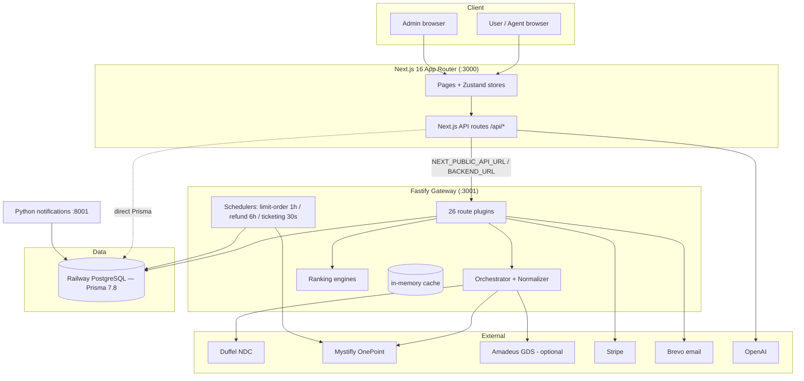

# ARCHITECTURE.md

> System-wide architecture. Derived from repository source. Unconfirmed items marked **Not confirmed from repository.**

## Purpose

The end-to-end technical architecture: frontend, backend gateway, database, providers, payments, background workers, notifications, and how a request flows through them.

## High-level topology



## Components

| Layer | Tech | Responsibility |
|---|---|---|
| Frontend | Next.js 16, React 19, Tailwind 4, Zustand | UI, checkout wizard, admin/agent consoles, client-side re-rank |
| Next.js API | App Router route handlers | Proxy to Fastify and/or direct Prisma; checkout confirm; AI endpoints |
| Backend gateway | Fastify 5 (+cors/compress/rate-limit), `tsx` | Search orchestration, provider calls, ranking, payments, notifications, schedulers |
| Data | PostgreSQL on Railway, Prisma 7.8 + adapter-pg | Persistence (shared generated client) |
| Providers | Duffel (NDC), Mystifly (GDS aggregator), Amadeus (optional) | Flight content + booking |
| Payments | Stripe (manual capture) | Customer card auth/capture/refund |
| Email | Brevo (backend direct + Python service) | Transactional email |
| AI | OpenAI (GPT-4o-mini / gpt-4.1-mini) | Explanations, DNA search, chatbot, voice |

## Request flows

### Search → ranked results
```mermaid
sequenceDiagram
    participant FE
    participant SR as /api/search (Fastify)
    participant OR as Orchestrator
    participant P as Duffel + Mystifly
    participant RK as Ranking engine
    FE->>SR: GET /api/search
    SR->>OR: searchFlights (parallel providers, cache)
    OR->>P: search (Duffel offer_requests; Mystifly v2.2 + v1)
    P-->>OR: raw offers
    OR-->>SR: normalized UnifiedFlight[] (append-only, no dedup)
    SR->>RK: rank (10-dim RT / 8-dim OW)
    RK-->>FE: ranked offers + badges + reasons
```

### Booking → ticket
See [BOOKING_LIFECYCLE.md](./BOOKING_LIFECYCLE.md) and provider docs. Summary: offer → Stripe auth → provider book (Duffel instant / Mystifly revalidate+book+ticket) → Stripe capture → persist `MasterBooking` → async ticketing reconciliation (Mystifly).

## Authentication

Three schemes (see [ADMIN_PORTAL.md](./ADMIN_PORTAL.md), [FRONTEND_ARCHITECTURE.md](./FRONTEND_ARCHITECTURE.md)):
- **User** — OTP (Brevo) → DB session token (Bearer), 15-min inactivity.
- **Admin** — OTP → `jose` JWT in HttpOnly `admin_token` cookie, 5-tier RBAC.
- **Agent** — user session + `FAREMIND_AGENT` role.

## Database

`MasterBooking`-centric OTA model + legacy `Booking` (price tracking). ~90 models, extensive enum state machines. See [DATABASE_SCHEMA.md](./DATABASE_SCHEMA.md).

## Redis

Documented (`REDIS_URL`, `RATE_LIMIT_REDIS_URL`) but **not used** — cache and rate limiting are in-memory (single-process). See [BACKEND_ARCHITECTURE.md](./BACKEND_ARCHITECTURE.md#caching-servicescachets).

## Background workers, polling, notifications, payment, booking, ticketing

- **Workers/schedulers:** limit-order (1h), refund-reconciliation (6h), ticketing-reconciliation (30s). [BACKGROUND_JOBS.md](./BACKGROUND_JOBS.md).
- **Polling:** ticketing reconciliation polls Mystifly `AirTicketOrderStatus`/`TripDetails` with backoff. [TICKETING_FLOW.md](./TICKETING_FLOW.md).
- **Notifications:** backend direct-Brevo `notify.ts` (live) + parallel Python FastAPI service. [BACKEND_ARCHITECTURE.md](./BACKEND_ARCHITECTURE.md#notifications--two-implementations).
- **Payment:** Stripe manual-capture, timing differs by provider. [PAYMENT_FLOW.md](./PAYMENT_FLOW.md).
- **Booking/ticketing:** [BOOKING_LIFECYCLE.md](./BOOKING_LIFECYCLE.md), [MYSTIFLY_BOOKING_FLOW.md](./MYSTIFLY_BOOKING_FLOW.md), [DUFFEL_INTEGRATION.md](./DUFFEL_INTEGRATION.md).

## Cross-cutting architectural observations
- **Provider abstraction is incomplete:** the production checkout re-implements provider HTTP inline (Duffel) and branches heavily by provider, rather than fully delegating to `provider-adapter.ts`.
- **Duplication:** ranking engine mirrored in `backend/` and `src/lib/`; Next.js and Fastify both expose many routes; two notification and two auth implementations.
- **Single-process assumptions:** in-memory cache/rate-limit/schedulers.

## Known issues / limitations
See [KNOWN_LIMITATIONS.md](./KNOWN_LIMITATIONS.md).

## Future enhancements
- Introduce Redis + distributed scheduler lock for horizontal scale.
- Consolidate duplicated engines/routes/services.
- Complete the provider-adapter abstraction.

## Related docs
[SYSTEM_OVERVIEW.md](./SYSTEM_OVERVIEW.md) · [BACKEND_ARCHITECTURE.md](./BACKEND_ARCHITECTURE.md) · [FRONTEND_ARCHITECTURE.md](./FRONTEND_ARCHITECTURE.md) · [DATABASE_SCHEMA.md](./DATABASE_SCHEMA.md) · [DEPLOYMENT.md](./DEPLOYMENT.md)
