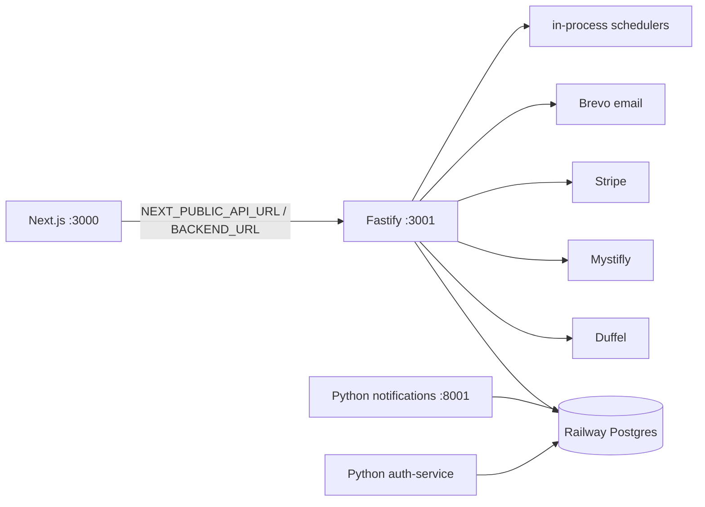

# BACKEND_ARCHITECTURE.md

> Derived from repository source. Unconfirmed items marked **Not confirmed from repository.**

## Purpose

Document the Fastify API gateway: bootstrap, route registration, CORS, rate limiting, caching, DB access, schedulers, and the auxiliary Python services.

## Overview

The backend is a standalone **Fastify** gateway ([`backend/src/index.ts`](../backend/src/index.ts)). Header comment describes: `Frontend (Next.js :3000) → Gateway (:3001) → External APIs + DB + Cache`. It runs TypeScript directly via `tsx` (`node --import tsx src/index.ts`), Node 22.

## Bootstrap (`main()`, index.ts:51-197)

1. `import './env'` first — [`env.ts`](../backend/src/env.ts) loads backend-local `.env` then root `../.env` (it does **not** validate vars).
2. Create Fastify with pino logger (`pino-pretty` non-prod), `keepAliveTimeout 65s`, `connectionTimeout 120s`, `bodyLimit 10 MB`.
3. Register `@fastify/cors`, `@fastify/compress` (global), `@fastify/rate-limit`.
4. Register **26 route plugins**.
5. 404 + global error handlers.
6. `listen({ port: PORT, host: '0.0.0.0' })` — `PORT → BACKEND_PORT → 3001`.
7. Start schedulers unless `DISABLE_SCHEDULERS=true`; register SIGTERM/SIGINT graceful shutdown.

## Registered route plugins (index.ts:134-158)

`/api/health`, `/api/search`, `/api/book`, `/api/bookings`, `/api/cancel`, `/api/auth`, `/api/airports`, `/api/notifications`, `/api/price-check`, `/api/price-monitor`, `/api/search-history`, `/api/popular-routes`, `/api/flexible-search`, `/api/fares`, `/api/price-protection`, `/api/booking-session`, `/api/checkout`, `/api/manage-booking`, `/api/voice`, `/api/admin/notification-recipients`, `/api/mystifly`, `/api/mystifly-ptr`, `/api/ranking`, `/api/limit-orders`, `/api/admin/cancellation-queue`.

Full method-level catalogue in [API_REFERENCE.md](./API_REFERENCE.md).

## CORS

Origins from `CORS_ORIGINS` (comma-separated) or `FRONTEND_URL`; supports `*`; `credentials: true`; methods `GET, POST, PATCH, DELETE, OPTIONS`. Rejected origins logged and denied.

## Rate limiting ([`lib/rate-limit.ts`](../backend/src/lib/rate-limit.ts))

- Enabled unless `RATE_LIMIT_ENABLED=false`. Global dynamic `max` via `getCachedLimit('GLOBAL')`, `timeWindow '1 minute'`, key = client IP.
- `onRoute` hook injects per-route limits by URL-prefix matching.
- **Priority:** `SystemConfig` DB value (cached 60s) → env var → hardcoded default.
- Hardcoded defaults/min: LOGIN 10, SIGNUP 5, OTP 5, FORGOT_PASSWORD 5, FLIGHT_SEARCH 60, BOOKING 20, PAYMENT 10, CONTACT 10, GLOBAL 120.
- Client IP: `cf-connecting-ip → x-forwarded-for[0] → x-real-ip → request.ip` (Cloudflare→Railway proxy chain).
- 429 body: `{statusCode:429, success:false, code:'RATE_LIMIT_EXCEEDED'}`.
- **Redis for distributed limiting is documented (`RATE_LIMIT_REDIS_URL`) but never read** — limiting is **in-memory only**.

## Caching ([`services/cache.ts`](../backend/src/services/cache.ts))

An **in-memory TTL cache** (`Map`), explicitly documented as having replaced the previous ioredis implementation. `cacheGet/Set/Del/DelPattern`, default TTL 120s, lazy cleanup every 60s. Key builders: `searchKey`, `fareOptionsKey`, `seatMapKey`, `priceProtectionKey`. **Redis is not used anywhere** (`REDIS_URL`/`RATE_LIMIT_REDIS_URL` never read).

## Turnstile ([`lib/turnstile.ts`](../backend/src/lib/turnstile.ts))
Cloudflare CAPTCHA; enforced only when `TURNSTILE_ENABLED='true'` (default false = dev bypass); never throws.

## Database access ([`lib/db.ts`](../backend/src/lib/db.ts))

- Prisma 7.8 with `PrismaPg` driver adapter over a `pg` `Pool`. Client generated to **root** `src/generated/prisma/client` and imported from there — shared with the Next.js frontend.
- Pool: `max 10`, `idleTimeoutMillis 30000`, `connectionTimeoutMillis 10000`. SSL `{rejectUnauthorized:false}` only in production (Railway). Singleton `getPrisma()`/`prisma`.
- Missing `DATABASE_URL` logs an error but does not throw.

## Schedulers

Three in-process crons started at boot (limit-order 1h, refund-reconciliation 6h, ticketing-reconciliation 30s). See [BACKGROUND_JOBS.md](./BACKGROUND_JOBS.md).

## Notifications — two implementations

- **Live path:** backend [`lib/notify.ts`](../backend/src/lib/notify.ts) sends email **directly via Brevo** (`fireNotification`); header states it "does NOT depend on the Python notification micro-service." Logs to `EmailLog`; resolves admin recipients from `NotificationRecipient` + hardcoded `SUPER_ADMIN_EMAIL`.
- **Parallel Python service:** `brain/notifications` (FastAPI) with its own DB tables/templates — see [DEPLOYMENT.md](./DEPLOYMENT.md#python-notifications-service). `backend/src/routes/notifications.ts` has a `proxyToService()` helper but its `POST /event` calls the in-process `fireNotification` directly. Which path production uses is **not fully confirmed from repository**.
- `services/notification-service.ts` — provider-agnostic abstraction with IN_APP (writes `Notification`) and a stubbed (disabled) Twilio SMS channel.

## Environment variables

Declared in [`.env.example`](../.env.example): `DATABASE_URL`; `DUFFEL_API_TOKEN`/`DUFFEL_API_URL`; `AMADEUS_*` (commented); `MYSTIFLY_USERNAME/PASSWORD/ACCOUNT_NUMBER/SESSION_ID/API_URL`; `STRIPE_SECRET_KEY`/`NEXT_PUBLIC_STRIPE_PUBLISHABLE_KEY`; `BREVO_API_KEY`/`BREVO_SENDER_EMAIL`; `OPENAI_API_KEY`/`OPENAI_MODEL`/`NEXT_PUBLIC_AI_CHATBOT_POOL_SIZE`; `NEXT_PUBLIC_APP_URL`/`NEXT_PUBLIC_API_URL`; `BACKEND_URL`; `FRONTEND_URL`/`CORS_ORIGINS`; `ADMIN_JWT_SECRET`; `NOTIFICATION_SERVICE_URL`; `REDIS_URL` (commented); `DUFFEL_ASSISTANT_ENABLED`.

Referenced in code but not in `.env.example`: `PORT`/`BACKEND_PORT`, `LOG_LEVEL`, `NODE_ENV`, `RATE_LIMIT_ENABLED` + `RATE_LIMIT_*_PER_MINUTE`, `DISABLE_SCHEDULERS`, `FLIGHT_PROVIDER_MODE`, `MYSTIFLY_TARGET`, `APP_URL`, `ADMIN_EMAIL`, `FAREMIND_BUNDLE`/`NEXT_PUBLIC_FAREMIND_BUNDLE`, `CRON_SECRET`, `TURNSTILE_ENABLED`/`TURNSTILE_SECRET_KEY`, `OPENAI_MODEL`.

## Auxiliary services
- **`brain/notifications`** (Python FastAPI, :8001) — see [DEPLOYMENT.md](./DEPLOYMENT.md).
- **`auth-service`** (Python FastAPI) — standalone OTP auth; loads `../backend/.env`; prints OTP to stdout (dev); **no Procfile/Dockerfile** — deployment status **not confirmed**. Overlaps the backend's own `/api/auth`, so likely legacy.

## Known issues / limitations
- In-memory cache + rate limit + `setInterval` crons ⇒ **no shared state across instances**; horizontal scaling would double-process crons and split cache. **Not confirmed** whether >1 backend instance runs.
- Exact **Fastify version** not confirmed (`backend/package.json` not read; health route reports `version '0.2.0'`).
- Two notification implementations and two auth implementations (backend vs Python) — duplication.
- `env.ts` does no validation — misconfiguration surfaces at runtime.

## Future enhancements
- Introduce Redis (already envisioned by env vars) for shared cache/rate-limit and a distributed scheduler lock.
- Consolidate notification + auth to single implementations.
- Add env-var validation at boot.

## Related docs
[API_REFERENCE.md](./API_REFERENCE.md) · [BACKGROUND_JOBS.md](./BACKGROUND_JOBS.md) · [DEPLOYMENT.md](./DEPLOYMENT.md) · [ARCHITECTURE.md](./ARCHITECTURE.md) · [DATABASE_SCHEMA.md](./DATABASE_SCHEMA.md)
