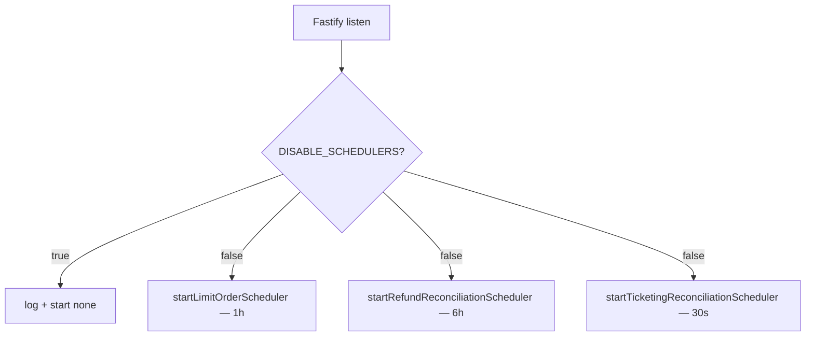

# BACKGROUND_JOBS.md

> Derived from repository source. Unconfirmed items marked **Not confirmed from repository.**

## Purpose

Document the scheduled workers: what each does, its interval, how it's started/stopped, and the guards.

## Overview

All schedulers run inside the Fastify backend process ([`backend/src/index.ts`](../backend/src/index.ts)), started in the `listen()` callback (L177-183) **only if `DISABLE_SCHEDULERS !== 'true'`**, and stopped on SIGTERM/SIGINT (L186-188). Each uses a module-level `setInterval` singleton (idempotent start, `clearInterval` on stop).

> `DISABLE_SCHEDULERS=true` is intended for local runs against the production DB, so crons don't fire from a developer machine.

## Schedulers

### 1. Limit Order Scheduler — [`workers/limit-order-cron.ts`](../backend/src/workers/limit-order-cron.ts)
- **Interval:** 1 hour (`DEFAULT_INTERVAL_MS = 60*60*1000`). Runs immediately on startup, then recurring.
- **Cycle** (`runSchedulerCycle`): (1) `expireStaleOrders()`, (2) `runLimitOrderSchedulerCycle()`, (3) `purgeExpiredOrders()`.
- **Logic** ([`services/limit-order-scheduler.ts`](../backend/src/services/limit-order-scheduler.ts)):
  - `runLimitOrderSchedulerCycle`: up to 50 `LimitOrder` (ACTIVE/MONITORING) with `nextEvaluationAt <= now`, `expiresAt > now`; groups by route+date; `searchFlights()` per route; `evaluateOrderAgainstFlights`; updates `lastEvaluatedAt`/`nextEvaluationAt`. Cadence by popularity: ≥5 orders→12h, 2-4→24h, 1→48h; failed route search backs off 24h.
  - `expireStaleOrders`: expires by 90-day validity / departure passed / within 24h lead time; sets `EXPIRED`, `purgeAt`; writes `LimitOrderEvent`.
  - `purgeExpiredOrders`: hard-deletes up to 100 EXPIRED past `purgeAt` (passengers → matches → events → order).
  - Constants: `DEFAULT_VALIDITY_DAYS=90`, `DEFAULT_PURGE_DELAY_HOURS=24`, `DEFAULT_MIN_PURCHASE_LEAD_TIME_HOURS=24`.

### 2. Refund Reconciliation Cron — [`workers/refund-reconciliation-cron.ts`](../backend/src/workers/refund-reconciliation-cron.ts)
- **Interval:** 6 hours. First run 30s after boot.
- **Cycle:** up to 50 `BookingRefund` where `providerReimbursementStatus IN (PENDING, PROCESSING)` and `nextProviderStatusCheckAt <= now`; calls `checkProviderReimbursement(id)` (in [`cancellation-orchestrator.ts`](../backend/src/services/cancellation-orchestrator.ts)).
- Progressive polling: 6h → 12h → 24h → overdue escalation. See [PAYMENT_FLOW.md](./PAYMENT_FLOW.md#provider-reimbursement-checkproviderreimbursement-called-by-refund-cron).
- **Note:** only re-polls `PENDING`/`PROCESSING`; `OVERDUE` records fall out of the polling set — **Not confirmed** whether another job handles OVERDUE.

### 3. Ticketing Reconciliation Cron — [`workers/ticketing-reconciliation-cron.ts`](../backend/src/workers/ticketing-reconciliation-cron.ts) + [`ticketing-reconciliation.ts`](../backend/src/workers/ticketing-reconciliation.ts)
- **Interval:** 30 seconds. First run 20s after boot.
- **Cycle** (`runTicketingReconciliation`): up to 20 `TicketingReconciliation` (PENDING/POLLING) due; polls Mystifly `AirTicketOrderStatus`, confirms terminal states with `TripDetails`.
- Per-record backoff: `0s, 15s, 30s, 60s, 2m, 5m, 10m` → ESCALATED at `MAX_AUTO_POLLS = 7`.
- Outcomes: RESOLVED_TICKETED / RESOLVED_NOT_BOOKED / ESCALATED / STILL_PENDING. Full detail in [TICKETING_FLOW.md](./TICKETING_FLOW.md).
- Cron logs a per-cycle tally; a failed cycle does not crash the scheduler.

## Other cron-like triggers (HTTP, not schedulers)

- `POST /api/price-monitor` — price-tracking trigger, protected by `x-cron-secret` (`CRON_SECRET`). Invoked by an external scheduler (e.g. Railway cron / external caller). **Which external scheduler calls it is Not confirmed from repository.**
- `POST /api/checkout/bookings/pre-revalidate` — invoked by the payment page, not a scheduler.

## Summary table

| Job | Interval | First run | Reads | Guard |
|---|---|---|---|---|
| Limit orders | 1h | immediate | `LimitOrder` | `DISABLE_SCHEDULERS` |
| Refund reconciliation | 6h | +30s | `BookingRefund` | `DISABLE_SCHEDULERS` |
| Ticketing reconciliation | 30s | +20s | `TicketingReconciliation` | `DISABLE_SCHEDULERS` |

## Known issues / limitations
- In-memory `setInterval` schedulers: in a multi-instance deployment each instance runs its own crons (no distributed lock). Combined with in-memory cache/rate-limit (Redis unused), horizontal scaling would double-process. **Not confirmed** the deployment runs multiple backend instances.
- OVERDUE refund records are not re-swept (above).

## Future enhancements
- Distributed locking (or a single worker instance) if scaling horizontally.
- Move price-monitor to an internal scheduler or document the external trigger.

## Related docs
[TICKETING_FLOW.md](./TICKETING_FLOW.md) · [PAYMENT_FLOW.md](./PAYMENT_FLOW.md) · [BACKEND_ARCHITECTURE.md](./BACKEND_ARCHITECTURE.md) · [DEPLOYMENT.md](./DEPLOYMENT.md)
