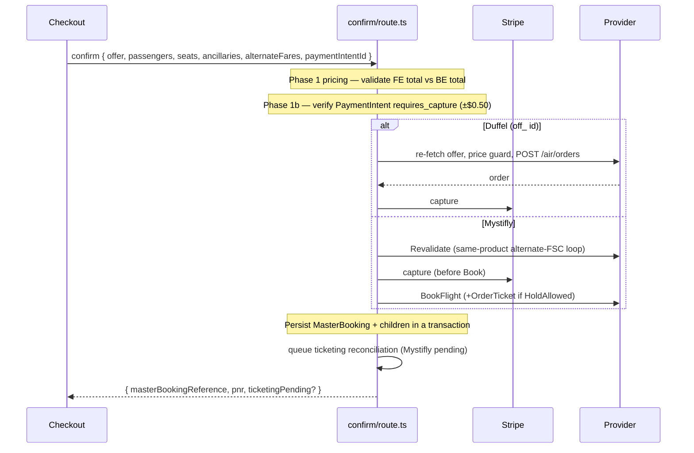

# BOOKING_LIFECYCLE.md

> Derived from repository source. Unconfirmed items marked **Not confirmed from repository.**

## Purpose

The end-to-end lifecycle of a booking across both providers — from offer selection through payment, provider booking, ticketing, and terminal states — and the state machine that governs it.

## Overview

The current OTA data model is `MasterBooking` + children (see [DATABASE_SCHEMA.md](./DATABASE_SCHEMA.md)). The orchestration lives in [`src/app/api/checkout/bookings/confirm/route.ts`](../src/app/api/checkout/bookings/confirm/route.ts) (~2,361 lines), which handles **both** Duffel and Mystifly, routing by offer-ID shape (`off_` → Duffel).

## State machine

```
MbBookingStatus:
  CREATED → PAYMENT_CAPTURED → PROVIDER_BOOKING_IN_PROGRESS →
  PROVIDER_BOOKED → CONFIRMED → TICKETING_PENDING → TICKETED → COMPLETED
  ┊ CANCEL_REQUESTED → CANCELLED
  ┊ FAILED | PROVIDER_BOOKING_FAILED | NOT_BOOKED

MbPaymentStatus:   PENDING → SUCCEEDED → (REFUNDED | PARTIALLY_REFUNDED) | FAILED
MbTicketingStatus: NOT_STARTED → IN_PROGRESS → TICKETING_PENDING → ISSUED
                                            ┊ PARTIALLY_ISSUED | FAILED | VOIDED
```

The three status fields on `MasterBooking` (`bookingStatus`, `paymentStatus`, `ticketingStatus`) advance semi-independently.

## Checkout funnel (frontend → confirm)

Wizard: `itinerary` → `passengers` → `seats` → `meals` → `addons` → `review` → `payment` → `confirm` ([`src/app/checkout/*`](../src/app/checkout/)). State in `useCheckoutStore` (+ `useAiBookingStore`, `useFareStore`). Key steps:
- **itinerary** — offer-expiry timer; builds `alternateFares` (fareSourceCode, cabin, refundable, changeable, totalPrice, checkedBags) from sibling fare options.
- **payment** — Stripe manual-capture PaymentIntent; sends `alternateFares` to confirm. For Mystifly, `pre-revalidate` refreshes the FSC when the page loads (commit `c883a17`).
- **confirm** — POSTs to `/api/checkout/bookings/confirm`.

## The confirm orchestration



### Phases (confirm/route.ts)
1. **Provider routing** (L301-337): `sourceProvider` (business), `routingProvider` corrected by offer-ID shape.
2. **Pricing** (L346-434): financial breakdown; `validateCheckoutPricing` guards FE vs BE totals.
3. **Stripe auth check** (L436-490): must be `requires_capture`, amount ≈ grand total.
4. **Provider booking** — Duffel (L523-962) or Mystifly (L964-1453). See [DUFFEL_INTEGRATION.md](./DUFFEL_INTEGRATION.md) / [MYSTIFLY_BOOKING_FLOW.md](./MYSTIFLY_BOOKING_FLOW.md).
5. **Persistence** (L1456-2013): `MasterBooking` + `BookingPnr`/`BookingJourney`/`BookingSegment`/`BookingPassenger`/`BookingTicket`/`BookingSeat`/`BookingMeal`/`BookingBaggage`/`BookingAncillary`/`BookingPayment` + raw payloads. `masterPnr = duffel booking_reference || mystifly uniqueId || generateRef()`. `initialTicketingStatus` mapping (L1541): ISSUED/SKIPPED_WEBFARE→ISSUED, TICKETING_PENDING, FAILED, else NOT_STARTED. `bookingStatus=CONFIRMED`, `paymentStatus=SUCCEEDED`.
6. **Post-transaction** (L2132+): queue Mystifly ticketing reconciliation; create ERBUK082 support ticket if pending.
7. **Response** (L2291): includes `ticketingPending`.

## Fare rules snapshot

Fare rules (`refundable`, `changeable`, fees, `fareRulesJson`) are frozen onto `BookingPnr` at booking time — the ranking engine's promises become the booking's terms.

## Idempotency

- `BookingAttempt.idempotencyKey` (unique) + `MasterBooking.bookingAttemptKey` (unique) + a 5-min soft lock (`lockedUntil`) prevent double-execution.
- `acquireBookingAttempt` is defined but **no call site was found in the checkout path** — **Not confirmed from repository** whether idempotency is active in production checkout. Present-day duplicate protection is Stripe-auth verification + `retries:0` on the provider Book call.

## Post-booking servicing

- **Customer:** `/manage-booking/[bookingId]` and `/account/bookings` — cancel, date-change, seat map, e-ticket, baggage.
- **Agent:** `/agent/*` — booking workspace, post-booking (Mystifly void/refund/reissue via `mystifly-ptr`), cancellations, refunds, passenger updates.
- **Admin:** `/admin/bookings/[id]` — full detail, cancel-action, references, notes, audit.
- **Change requests:** `ChangeRequest` model + backend `manage-booking` `/change/*` routes (Duffel order changes; Mystifly reissue via PTR).

## Timeline / audit

Every significant action writes a `BookingEvent` (eventType, actorType system/admin/agent, payloadJson). `BookingProviderPayload` stores raw provider request/response snapshots by `payloadType`. Admin/agent read these for support.

## Failure scenarios

See [PAYMENT_FLOW.md](./PAYMENT_FLOW.md#failure-scenarios). Provider booking failure never charges the customer (Duffel) or refunds after capture (Mystifly), except ERBUK082 which is a valid pending path.

## Known issues / limitations
- Two booking models (`Booking` legacy vs `MasterBooking`); only `MasterBooking` is in the live checkout.
- Idempotency helper not confirmed wired (above).
- The confirm route is very large (~2,361 lines) — high-complexity single file.

## Future enhancements
- Wire `acquireBookingAttempt` idempotency into confirm.
- Consider decomposing the confirm route by provider.

## Related docs
[MYSTIFLY_BOOKING_FLOW.md](./MYSTIFLY_BOOKING_FLOW.md) · [DUFFEL_INTEGRATION.md](./DUFFEL_INTEGRATION.md) · [PAYMENT_FLOW.md](./PAYMENT_FLOW.md) · [TICKETING_FLOW.md](./TICKETING_FLOW.md) · [DATABASE_SCHEMA.md](./DATABASE_SCHEMA.md)
