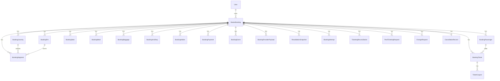

# DATABASE_SCHEMA.md

> Permanent engineering reference. Source of truth: [`prisma/schema.prisma`](../prisma/schema.prisma) (≈3,062 lines). Everything below is derived from that file. Where a detail is not in the repo it is marked **Not confirmed from repository.**

## Purpose

Document the complete FareMind persistence model: every Prisma model, the enums that drive state machines, the domain groupings, and the relationships that matter for booking, ticketing, payments, and support.

## Overview

- **ORM:** Prisma `7.8` with the new `prisma-client` generator, output to [`src/generated/prisma`](../src/generated/prisma) ([`prisma/schema.prisma:6-9`](../prisma/schema.prisma#L6-L9)).
- **Datasource:** PostgreSQL (`provider = "postgresql"`), hosted on Railway. Connection via `DATABASE_URL` ([`prisma.config.ts`](../prisma.config.ts)).
- **Runtime adapter:** `@prisma/adapter-pg` (driver adapter over `pg`) — see `package.json` dependencies.
- **Naming convention:** models are PascalCase in Prisma, mapped to `snake_case` tables via `@@map`, and fields mapped via `@map`. Primary keys are `cuid()` strings unless noted.
- **Two booking data models coexist:**
  - **Legacy `Booking`** (`bookings` table) — retained for the price-tracking / rebooking engine.
  - **`MasterBooking`** (`master_bookings`) — the professional OTA data model used by the current checkout/booking/ticketing pipeline. **New work should use `MasterBooking` and its children.**

## Domain groupings

The schema is organized by comment banners into these sections:

| Section | Key models |
|---|---|
| User & Auth | `User`, `Session`, `OtpCode` |
| Flight Search & Caching | `SearchHistory`, `CachedSearch` |
| Legacy Bookings | `Booking`, `Passenger`, `FlightSegment` |
| Price Tracking & AI Agent | `PriceHistory`, `PriceAlert`, `PriceTrackingJob` |
| Rebooking Engine | `Rebooking` |
| Legacy Payments & Ledger | `Payment`, `LedgerEntry` |
| Notifications | `Notification` |
| Saved Routes | `SavedRoute` |
| Reference Data | `Airline`, `Airport` |
| **Master Bookings (OTA model)** | `MasterBooking`, `BookingPnr`, `BookingJourney`, `BookingSegment`, `BookingPassenger`, `BookingTicket`, `TicketCoupon`, `BookingSeat`, `BookingMeal`, `BookingBaggage`, `BookingAncillary`, `BookingAddon`, `BookingPayment`, `BookingEvent`, `BookingNote`, `BookingProviderPayload` |
| Admin Auth | `AdminUser`, `AdminOtp`, `AdminSession` |
| Support System | `SupportTicket`, `SupportTicketMessage`, `WhatsAppSupportNumber` |
| Partners (B2B) | `Partner`, `PartnerUser`, `CommissionRule`, `PartnerSettlement` |
| Change / Cancellation | `ChangeRequest`, `CancellationRecord`, `BookingRefund`, `ProviderReimbursementCheck`, `BookingPassengerUpdate` |
| Audit & Sync | `AuditLog`, `ProviderSync`, `BookingFailureAudit`, `EmailLog` |
| AI / DNA | `AiDynamicProfile`, `FareAiScore`, `TravelDnaProfile`, `TravelDnaPreference`, `TravelDnaConfig` |
| Commercial Fee Management | `PlatformFeeRule`, `ProtectionProductRule`, `TravelInsuranceRule`, `FareTierTemplate`, `BookingCommercialCharge`, `BookingOfferSession` |
| System / Config | `SystemConfig`, `NotificationRecipient`, `PaymentMethod` |
| **Mystifly / Provider Lifecycle** | `RevalidationSnapshot`, `BookingAttempt`, `TicketingReconciliation`, `ProviderFareInventoryRule`, `ProviderHoldRule`, `PostTicketingRequest` |
| Service Payments | `ServicePayment` |
| Limit Orders | `LimitOrder`, `LimitOrderMatch`, `LimitOrderEvent`, `LimitOrderPassenger` |

## Core relationship diagram (MasterBooking)



## MasterBooking — the central model

[`prisma/schema.prisma:513-646`](../prisma/schema.prisma#L513-L646). Table `master_bookings`.

Notable field groups:

- **Identity:** `masterBookingReference` (unique), `masterPnr`.
- **Customer:** `customerEmail`, `customerName`, `userId?`.
- **Trip:** `tripType` (`MbTripType`), origin/destination airport/city/country, `departureDate`, `returnDate?`.
- **Status triplet (state machine):** `bookingStatus` (`MbBookingStatus`), `paymentStatus` (`MbPaymentStatus`), `ticketingStatus` (`MbTicketingStatus`).
- **Financials:** `totalAmount` (customer grand total), `providerPayableTotal`/`providerCurrency` (settlement), `markupAmount`/`serviceFeeAmount`/`fareMindRevenueTotal` (revenue), `priceProtectionAmount`/`travelInsuranceAmount`/`thirdPartyPayableTotal` (vendor payables), `seatServiceTotal`.
- **Provider:** `primaryProvider` (default `"duffel"`), `providerOfferId`, `providerOrderId`, `rawProviderPayload`, `providerCapabilities`, `offerProvidedAt`, `offerExpiresAt`.
- **PNR strategy:** `pnrStrategy` (`PnrStrategy`), `isSplitTicket`, `isSelfTransfer`, `connectionProtStatus` (`ConnProtStatus`), `providerMix`, `pnrCount`, `riskLabel`, `riskExplanation`.
- **Agent ownership:** `createdByRole` (`'AGENT' | 'CUSTOMER' | null`), `agentUserId`, `agentName`, `agentEmail`.
- **Duffel Assistant / provider support:** `duffelCustomerUserId`, `lastProviderSupportOpenedAt/By`, `providerSupportSessionCount`.
- **Mystifly / provider lifecycle** ([`schema.prisma:620-627`](../prisma/schema.prisma#L620-L627)):
  - `searchFareSourceCode` — original FSC from search.
  - `revalidatedFareSourceCode` — FSC returned by Revalidation.
  - `mystiflyMfRef` — Mystifly booking `UniqueID`.
  - `providerBookingStatus` — raw provider status text.
  - `providerEnvironment` — `'Test' | 'Production'`.
  - `providerApiVersion` — `'v1' | 'v2' | 'v2.2'`.
  - `bookingAttemptKey` — unique idempotency key.

## Booking child models (quick reference)

| Model | Table | Purpose | Ref |
|---|---|---|---|
| `BookingPnr` | `booking_pnrs` | One record per airline/provider PNR; stores fare rules at booking time (`refundable`, `changeable`, `cancellationFee`, `changeFee`, `fareRulesJson`) | [L650](../prisma/schema.prisma#L650) |
| `BookingJourney` | `booking_journeys` | Outbound/return journey summary (`direction` = `JourneyDir`) | [L688](../prisma/schema.prisma#L688) |
| `BookingSegment` | `booking_segments` | Individual flight hops with layover info, `rawSegmentPayload` | [L728](../prisma/schema.prisma#L728) |
| `BookingPassenger` | `booking_passengers` | Passengers with passport/nationality, `providerPassengerId` | [L792](../prisma/schema.prisma#L792) |
| `BookingTicket` | `booking_tickets` | E-ticket numbers, `ticketStatus` (`TicketStatus`), `rawTicketPayload` | [L827](../prisma/schema.prisma#L827) |
| `TicketCoupon` | `ticket_coupons` | One coupon per segment per ticket, `couponStatus` (`CouponStatus`) | [L863](../prisma/schema.prisma#L863) |
| `BookingSeat` | `booking_seats` | Selected seats, `seatStatus` (`SeatStatus`), `seatPrice` | [L892](../prisma/schema.prisma#L892) |
| `BookingMeal` | `booking_meals` | Meal selections, `mealStatus` (`MealStatus`) | [L919](../prisma/schema.prisma#L919) |
| `BookingBaggage` | `booking_baggage` | Extra baggage units | [L946](../prisma/schema.prisma#L946) |
| `BookingAncillary` | `booking_ancillaries` | Provider ancillaries (bag/seat/meal/lounge), `rawProviderData`, `providerServiceId` | [L972](../prisma/schema.prisma#L972) |
| `BookingAddon` | `booking_addons` | Insurance, price protection, etc. | [L999](../prisma/schema.prisma#L999) |
| `BookingPayment` | `booking_payments` | Stripe PaymentIntent linkage, `status` (`MbPaymentTxStatus`) | [L1025](../prisma/schema.prisma#L1025) |
| `BookingEvent` | `booking_events` | Timeline/audit events on a booking | [L1048](../prisma/schema.prisma#L1048) |
| `BookingNote` | `booking_notes` | Internal admin notes | [L1069](../prisma/schema.prisma#L1069) |
| `BookingProviderPayload` | `booking_provider_payloads` | Raw provider request/response snapshots by `payloadType` | [L1087](../prisma/schema.prisma#L1087) |

## Provider-lifecycle & reconciliation models (Mystifly-centric)

| Model | Table | Purpose | Ref |
|---|---|---|---|
| `RevalidationSnapshot` | `revalidation_snapshots` | Records each Revalidate call: search vs revalidated FSC + fare, `priceChanged`, `accepted`, raw req/resp | [L2553](../prisma/schema.prisma#L2553) |
| `BookingAttempt` | `booking_attempts` | Idempotency ledger keyed on `idempotencyKey` (unique); tracks `status` (`BookingAttemptStatus`), `paymentCaptured`, `refundInitiated`, `lockedUntil` | [L2581](../prisma/schema.prisma#L2581) |
| `TicketingReconciliation` | `ticketing_reconciliations` | Poll queue for TICKETING_PENDING; `status` (`TicketReconStatus`), `pollCount`, `nextPollAt`, `ticketNumbers[]`, `tripDetailsResponse` | [L2633](../prisma/schema.prisma#L2633) |
| `ProviderFareInventoryRule` | `provider_fare_inventory_rules` | Admin-managed rules mapping fare type/route/airline → `holdAllowed`, `holdDurationMinutes`, `searchVersion`, `target` | [L2679](../prisma/schema.prisma#L2679) |
| `ProviderHoldRule` | `provider_hold_rules` | Hold-allowed rules by fare type/airline/route, `holdDurationMinutes` (default 60) | [L2711](../prisma/schema.prisma#L2711) |
| `PostTicketingRequest` | `post_ticketing_requests` | Void/Refund/Reissue quote+exec workflow, `requestType` (`PtrRequestType`), `status` (`PtrStatus`) | [L2733](../prisma/schema.prisma#L2733) |

## Enums (state machines)

### Booking / ticketing / payment (MasterBooking pipeline)

```
MbBookingStatus:   CREATED → PAYMENT_CAPTURED → PROVIDER_BOOKING_IN_PROGRESS →
                   PROVIDER_BOOKED → CONFIRMED → TICKETING_PENDING → TICKETED →
                   COMPLETED  |  CANCEL_REQUESTED → CANCELLED
                   |  FAILED | PROVIDER_BOOKING_FAILED | NOT_BOOKED
MbPaymentStatus:   PENDING | PARTIAL | SUCCEEDED | FAILED | REFUNDED | PARTIALLY_REFUNDED
MbTicketingStatus: NOT_STARTED | IN_PROGRESS | TICKETING_PENDING | ISSUED |
                   PARTIALLY_ISSUED | FAILED | VOIDED
MbPaymentTxStatus: PENDING | SUCCEEDED | FAILED | REFUNDED | PARTIALLY_REFUNDED
TicketStatus:      PENDING | ISSUED | VOIDED | REFUNDED | EXCHANGED
CouponStatus:      OPEN | FLOWN | EXCHANGED | REFUNDED | VOIDED | UNAVAILABLE
SeatStatus:        SELECTED | CONFIRMED | UNAVAILABLE | CHANGED
MealStatus:        REQUESTED | CONFIRMED | UNAVAILABLE
```
([`schema.prisma:1865-1932`](../prisma/schema.prisma#L1865-L1932))

### Provider-lifecycle enums

```
BookingAttemptStatus: PENDING | LOCKED | PAYMENT_CAPTURED | PROVIDER_BOOKING_SENT |
                      PROVIDER_BOOKING_SUCCESS | PROVIDER_BOOKING_FAILED |
                      TICKETING_SENT | TICKETING_SUCCESS | TICKETING_PENDING |
                      COMPLETED | FAILED | REFUNDED
TicketReconStatus:    PENDING | POLLING | TICKETED | NOT_BOOKED | MANUAL_REVIEW |
                      ESCALATED | RESOLVED | FAILED
PtrRequestType:       VOID_QUOTE | VOID | REFUND_QUOTE | REFUND | REISSUE_QUOTE | REISSUE
PtrStatus:            QUOTE_PENDING | QUOTE_RECEIVED | QUOTE_EXPIRED | AWAITING_APPROVAL |
                      APPROVED | EXECUTING | COMPLETED | FAILED | CANCELLED
```
([`schema.prisma:2614-2790`](../prisma/schema.prisma#L2614-L2790))

### PNR / journey / connection enums

```
PnrStrategy:    SINGLE_PNR | DIRECTION_PNR | SEGMENT_PNR | PROVIDER_SPLIT | UNKNOWN
PnrType:        MASTER_AIRLINE_PNR | AIRLINE_PNR | PROVIDER_PNR | SPLIT_TICKET_PNR | SUB_PNR
PnrStatus:      ACTIVE | PENDING | CANCELLED | EXCHANGED | UNKNOWN
PnrDir:         ALL | OUTBOUND | RETURN
JourneyDir:     OUTBOUND | RETURN
ConnProtStatus: PROTECTED | PARTIALLY_PROTECTED | NOT_PROTECTED | UNKNOWN
```

### Cancellation / refund / reconciliation enums

```
CancellationStatus:         CANCEL_REQUESTED | CANCEL_INITIATED | CANCEL_PROVIDER_PENDING |
                            CANCEL_CONFIRMED | CANCEL_UNKNOWN | IN_PROGRESS | CANCELLED |
                            REFUND_PENDING | REFUNDED | FAILED
RefundMethod:               ORIGINAL_PAYMENT | AIRLINE_CREDIT
RefundStatus:               INITIATED | PROCESSING | COMPLETED | FAILED | PARTIAL |
                            CUSTOMER_REFUND_PENDING | CUSTOMER_REFUNDED | CUSTOMER_REFUND_FAILED
ProviderReimbursementStatus:NOT_STARTED | PENDING | PROCESSING | REIMBURSED | FAILED | OVERDUE
ReconciliationStatus:       RECONCILIATION_PENDING | MATCHED | MISMATCH | MANUAL_REVIEW |
                            RECONCILIATION_COMPLETED
ChangeRequestStatus:        NEW | QUOTED | CUSTOMER_PAYMENT_PENDING | CONFIRMED | REJECTED | CANCELLED
```

### Reference / role enums

```
Provider:      DUFFEL | AMADEUS | MYSTIFLY
CabinClass:    ECONOMY | PREMIUM_ECONOMY | BUSINESS | FIRST
TripType:      ONE_WAY | ROUND_TRIP | MULTI_CITY   (MbTripType mirrors this)
UserRole:      USER | ADMIN | FAREMIND_AGENT
AdminRole:     SUPER_ADMIN | OPS_ADMIN | SUPPORT | FINANCE | READ_ONLY
Gender:        MALE | FEMALE | OTHER
PassengerType: ADULT | CHILD | INFANT
```

### Legacy booking / price-tracking / commercial enums

`BookingStatus`, `PriceAlertStatus`, `TrackingJobStatus`, `RebookingStatus`, `PaymentType`, `PaymentStatus`, `LedgerType`, `NotificationType`, `NotificationChannel`, `NotificationStatus`, `PartnerStatus`, `AddonType`, `ChangeRequestType`, `FeeType`, `CalculationModel`, `ProviderScopeEnum`, `CabinScopeEnum`, `TripTypeScopeEnum`, `RouteScopeTypeEnum`, `ProtectionPricingModel`, `InsurancePricingModel`, `ChargeType`, `ChargeSourceType`, `TravelDnaProfileType`, `TravelDnaStatus`, `ServicePaymentType`, `LimitOrderStatus`, `LimitOrderExecMode` — see [`schema.prisma:1651-3062`](../prisma/schema.prisma#L1651-L3062) for full member lists.

## Idempotency & concurrency

- `BookingAttempt.idempotencyKey` is `@unique` and `MasterBooking.bookingAttemptKey` is `@unique` — these enforce single-execution of a provider booking. `lockedAt`/`lockedUntil` implement a soft lock. See [BOOKING_LIFECYCLE.md](./BOOKING_LIFECYCLE.md) for how they are used.
- `SupportTicket.sequenceNumber` uses `@default(autoincrement())` and `ticketNumber` is unique for human-readable IDs.

## Business rules encoded in the schema

- Fare rules (`refundable`, `changeable`, fees) are **snapshotted at booking time** on `BookingPnr` — the ranking engine's promises are frozen into the booking.
- Financials separate four payable buckets on `MasterBooking`: customer total, provider settlement, FareMind revenue, third-party vendor payables. This supports the agency-balance settlement model.
- `providerEnvironment` and `providerApiVersion` are persisted per booking so support can tell which Mystifly environment/version produced a record.

## Known issues / limitations

- Two parallel booking models (`Booking` vs `MasterBooking`) increase surface area; the legacy `Booking` is only for price tracking/rebooking. **Not confirmed from repository** whether any migration to consolidate is planned.
- Several `raw*Json` / `Json?` fields (`rawProviderPayload`, `rawSegmentPayload`, `fareRulesJson`, etc.) are untyped; their shape depends on provider and is **not enforced by the schema**.
- Migration history: `prisma/migrations` path is configured ([`prisma.config.ts`](../prisma.config.ts)) — **actual migration files were not enumerated in this pass; not confirmed from repository.**

## Future enhancements

- Consider typed JSON columns (Prisma `Json` + zod validation) for provider payloads.
- Consolidate legacy `Booking` price-tracking fields into `MasterBooking` + `PriceTrackingJob`.

## Related docs

- [BOOKING_LIFECYCLE.md](./BOOKING_LIFECYCLE.md) · [TICKETING_FLOW.md](./TICKETING_FLOW.md) · [PAYMENT_FLOW.md](./PAYMENT_FLOW.md) · [MYSTIFLY_BOOKING_FLOW.md](./MYSTIFLY_BOOKING_FLOW.md)
