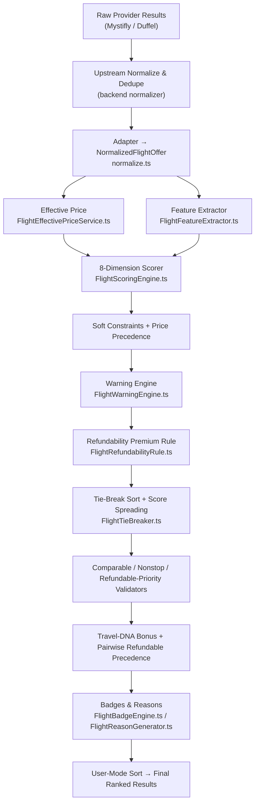

# FareMind Flight Ranking & Scoring Algorithm

> **Status:** authoritative — verified against the implementation on 2026‑07‑20.
> **Authoritative code path:** `rankFlightOffers()` in [`engine.ts`](../src/lib/ai-scoring/engine.ts)
> + `scoreFlightOffer()` / `computeScoringStats()` in [`FlightScoringEngine.ts`](../src/lib/ai-scoring/FlightScoringEngine.ts).
> The legacy `aiRank()` path still exists in the same file but is **not** the current pipeline.

---

## 1. Architecture

> **Note:** Deduplication (e.g. 183 raw → ~139 unique) happens **upstream** in the backend
> normalizer, *before* offers reach this scoring pipeline. The AI-scoring `normalize.ts` only
> adapts shapes; it does not dedupe.

---

## 2. The 8 Scoring Dimensions

Each offer is scored 0–100 on 8 dimensions, then combined with a weighted sum into a **base score**.

| # | Dimension | Dom OW | Dom RT | Intl OW | Intl RT |
|---|-----------|:-----:|:-----:|:------:|:------:|
| 1 | **Effective Price** | 36% | 34% | 35% | 35% |
| 2 | **Duration** | 23% | 21% | 21% | 19% |
| 3 | **Stops** | 15% | 14% | 10% | 10% |
| 4 | **Baggage Value** | 10% | 11% | 12% | 13% |
| 5 | **Layover Quality** | 7% | 8% | 10% | 10% |
| 6 | **Schedule** | 4% | 5% | 4% | 5% |
| 7 | **Fare Flexibility** | 3% | 4% | 5% | 5% |
| 8 | **Provider Reliability** | 2% | 3% | 3% | 3% |

Source: `FLIGHT_SCORING_CONFIG` and `INTERNATIONAL_BASE_WEIGHTS` in
[`FlightScoringConfig.ts`](../src/lib/ai-scoring/FlightScoringConfig.ts).

> International routes reduce the **Stops** weight (1 stop is normal for long-haul) and boost
> **Baggage / Layover / Flexibility** (bigger real-world impact on international trips).
> A route is *international* when departure and arrival airports are in **different countries**
> (resolved from `src/data/airports.ts`).

### Dimension details

**1. Effective Price** — `clippedNorm` between the **p5** and **p95** of all candidate effective prices, ×100.
- Cheapest = 100; most expensive → 0.
- **Guardrails:** within 3% of cheapest → floored at **93**; within 5% → floored at **88**;
  10–20% above → up to −10; >20% above → up to −25.
- **Effective price** = base fare **+ estimated checked-bag cost** when bags aren't included:
  **$35** domestic / **$75** international per piece × passengers × legs (round-trip = ×2).
  Skipped entirely if the user selected carry-on-only or the fare already includes checked bags.

**2. Duration** — `clippedNorm` between p5 and p95 of durations, ×100. Shortest = 100.

**3. Stops** — fixed table:

| Stops | 0 | 1 | 2 | 3 | 4 | 5+ |
|-------|:-:|:-:|:-:|:-:|:-:|:--:|
| Score | 100 | 85 | 72 | 58 | 45 | 30 |

**4. Baggage Value**

| Included | Score |
|----------|:-----:|
| 2+ checked + carry-on | 100 |
| 1 checked + carry-on | 90 |
| Carry-on only | 70 |
| Checked only, no carry-on stated | 60 |
| Nothing (international) | 42 |
| Nothing (domestic) | 50 |
| Unclear | 55 |

- Carry-on-only preference: closes 50% of the gap to 100 when no checked bag.
- Family / elderly preference: −10 when no checked bag.

**5. Layover Quality** — starts at 100 (nonstop), deductions per layover:

| Condition | Deduction |
|-----------|:---------:|
| < 75 min (intl) / < 45 min (dom) | −25 |
| < 90 min (intl) / < 60 min (dom) | −10 |
| > 5 h (>300 min) | −15 |
| > 8 h (>480 min) | −30 |
| Overnight (`isOvernight` or >10 h) | −35 |
| Airport change | −30 |
| Self-transfer | −30 |

**6. Schedule Convenience** — starts at 100, deductions:

| Condition | Deduction |
|-----------|:---------:|
| Red-eye (dep ≥ 21:00 or < 01:00, arr 04:00–09:00) | −10 (−15 if `avoidRedEye`) |
| Pre-dawn departure (00:00–06:00) | −8 (−12 for family/elderly) |
| Late arrival (≥ 23:00) | −8 |
| Very early arrival (00:00–05:00) | −6 intl / **−12 domestic** |

Applied to the outbound leg, and to the return leg on round-trips.

**7. Fare Flexibility**

| Condition | Score |
|-----------|:-----:|
| Refundable + Changeable | 100 |
| Refundable only | 80 |
| Changeable only | 75 |
| Neither | 40 |
| Unknown | 60 |

- Firm-dates preference: +20 when score < 60.

**8. Provider Reliability** — dynamic health metrics when available
(search 0.2 / revalidation 0.3 / booking 0.4 / latency 0.1), else static defaults:
**Duffel 95, Mystifly 90**, unknown 80.

---

## 3. Scoring Modes (weight multipliers)

Applied on top of the trip-type base weights, then **re-normalized to sum to 1.0**.

| Mode | Price | Duration | Stops | Baggage | Layover | Schedule | Flexibility |
|------|:----:|:-------:|:----:|:------:|:------:|:-------:|:----------:|
| **AI Pick** | 1.0 | 1.0 | 1.0 | 1.0 | 1.0 | 1.0 | 1.0 |
| **Best Value** | 1.2 | 1.1 | 1.0 | 1.0 | 1.0 | 1.0 | 1.0 |
| **Cheapest** | 1.6 | 0.7 | 0.7 | 0.6 | 1.0 | 1.0 | 1.0 |
| **Fastest** | 0.6 | 1.8 | 1.2 | 1.0 | 1.1 | 1.0 | 1.0 |
| **Fewest Stops** | 0.7 | 1.0 | 2.3 | 1.0 | 0.6 | 1.0 | 1.0 |
| **Comfort** | 0.6 | 1.0 | 1.4 | 1.4 | 1.5 | 1.5 | 1.0 |
| **Family** | 0.7 | 1.0 | 1.3 | 1.8 | 1.6 | 1.5 | 1.0 |
| **Elderly** | 0.7 | 1.2 | 1.8 | 1.3 | 1.7 | 1.6 | 1.0 |
| **Flexible Fare** | 0.7 | 0.8 | 1.0 | 1.0 | 1.0 | 1.0 | 3.0 |

### Price-weight floor
After normalization, if the **effective-price weight** falls below **`MIN_PRICE_WEIGHT_FRACTION = 0.30`**,
it is raised to 0.30 and the excess is redistributed proportionally from the non-price dimensions.
This guarantees price keeps ≥30% influence in **every** mode.

---

## 4. Soft Constraints & Price Precedence

> **Order matters:** these are applied to the **base score first**, and warning penalties are
> subtracted **afterward**:
> `finalScore = clamp(baseScore − warningPenalty − compoundWarningPenalty, 0, 100)`.

Applied to the base score (in order):

- **Over budget:** `−min(overPct × 30, 25)` (up to −25).
- **Over max duration:** `−min(overPct × 25, 20)` (up to −20).
- **Stops preference violated:** ×0.6 (nonstop pref + has stops), ×0.75 (1-stop pref + 2+ stops),
  ×0.80 (2-stop pref + 3+ stops).
- **Price Precedence Penalty:** when effective price exceeds the cheapest by more than
  **15%**, subtract `min((pctAbove − 0.15) × 50, 25)` (up to −25). Applied **after** the weighted
  composite so it cannot be overcome by high non-price scores — lower fares always take precedence.

---

## 5. Warning Penalties

Warnings are generated after base scoring and deducted. Per-warning points:

| Warning | Severity | Penalty |
|---------|----------|:-------:|
| Self-transfer | CRITICAL | −16 |
| Suspicious price (< 30% of cheapest) | CRITICAL | −16 |
| Airport change | CRITICAL | −15 |
| Provider revalidation risk | CRITICAL | −15 |
| Tight connection | CRITICAL | −14 |
| Extreme duration (>80% over fastest) | MAJOR | −9 |
| Overnight layover | MAJOR | −7 |
| 3+ connections | MAJOR | −7 |
| Significantly longer duration (>40%) | MAJOR | −6 |
| Non-refundable + non-changeable | MAJOR | −6 |
| No checked bag (intl) | MEDIUM | −5 |
| Long layover | MEDIUM | −4 |
| Low data confidence | MEDIUM | −4 |
| Paid baggage only | MEDIUM | −4 |
| Much higher than comparable (>30%) | MEDIUM | −4 |
| Two connections | MEDIUM | −4 |
| No checked bag (domestic) | MEDIUM | −3 |
| Non-refundable | MEDIUM | −3 |
| Non-changeable | MEDIUM | −3 |
| Higher than comparable (>20%) | MINOR | −2 |
| Late-night arrival | MINOR | −2 |
| Slightly long layover | MINOR | −2 |
| Slightly higher price (>10%) | MINOR | −1.5 |
| Early-morning departure | MINOR | −1.5 |
| One stop when nonstop exists | MINOR | −1.5 |
| Fare rules unknown | MINOR | −1.5 |

### Compound penalty (stacking)
Added on top of the summed per-warning points:

- 2 warnings → **+1.5**, 3 → **+3**, 4+ → **+5**
- ≥2 MAJOR → **+2**
- ≥1 CRITICAL → **+5**, ≥2 CRITICAL → **+8**

---

## 6. AI Pick Eligibility

A flight qualifies for the **AI Pick** badge when:
- `finalScore ≥ 85`, **and**
- no AI-pick-blocking warning is present. The blocking warnings are all CRITICAL:
  self-transfer, airport change, tight connection, provider revalidation risk, suspicious price.

Only the single top-ranked offer at the maximum score receives the badge.

---

## 7. Refundability Handling

Two cooperating mechanisms:

**a) Refundability Premium Rule** (`FlightRefundabilityRule.ts`) — for each refundable fare, find the
single most comparable **changeable-only** fare (same cabin/currency; exact stop match preferred, else
±1 stop within 35% duration). Adjustment = `premiumBand × comparabilityFactor`, applied to the score
**before** warnings:

- Premium bands (refundable's % premium over the comparable): ≤5% → +15, ≤10% → +12, ≤15% → +8, ≤20% → +5.
- Overpriced bands: ≤35% → −3, ≤50% → −5, >50% → −8.
- Comparability factors: same stops & ≤15% dur → 1.00; same stops & 15–35% → 0.85; +1 stop & ≤20% → 0.75; +1 stop & 20–35% → 0.60.

**b) Pairwise Refundable Precedence** (`FlightPairwisePrecedenceService.ts`) — a **position-only** move
(no score change): a qualifying refundable fare is moved to sit **immediately above** its matched
changeable comparator if it ranked below it. Never forced into any Top-N window; skipped if it carries a CRITICAL warning.

---

## 8. Full Ranking Pipeline — `rankFlightOffers()`

1. **Adapt** each offer to `NormalizedFlightOffer`.
2. **Effective price** — add estimated bag costs.
3. **Feature extraction** — layovers, schedule hours, stops, baggage, flexibility, international flag.
4. **Quality filter** — drop offers with missing price/duration, any layover **< 45 min**, or total duration **> 2× the fastest**.
5. **Scoring stats** — p5/p95, min/max for price & duration. When cabin-class filters are active and ≥3 offers qualify, stats are computed **within the selected cabin** so business isn't scored against economy.
6. **Score** every candidate (8 dimensions → base → soft constraints → price precedence → warnings → final).
   - **6.5 Refundability Premium Rule.**
7. **Tie-break sort** — primary by `finalScore`; when within 2 points: fewer CRITICAL warnings → fewer MAJOR warnings → lower effective price (>2%) → *(intl: shorter duration then fewer stops / domestic: fewer stops then shorter duration)* → better baggage → better flexibility → better provider reliability → earlier departure.
8. **Score spreading** — enforce at least a **1-point gap** between consecutively ranked offers (so the list isn't all "100").
   - **8.5 Comparable-offer validation** — a cheaper comparable offer must rank ≥ a pricier one unless a justified premium exists (better baggage / flexibility / meaningfully better duration or schedule / provider risk on the cheaper one).
   - **8.55 Comparable nonstop low-fare validation** (AI Pick / Best Value / Cheapest).
   - **8.58 Fully-refundable priority validation** (AI Pick / Best Value).
   - **8.6 Re-sort** after the above adjustments.
   - **8.7 Travel-DNA bonus** — additive only: airline match up to **+5**, cabin up to **+3**, stops up to **+2** (max **+10**), then re-sort.
   - **8.9 Pairwise refundable precedence** — final position-only move.
9. **Badges** — AI Pick, Cheapest (by displayed fare), Fastest, Fewest Stops, Nonstop, Best Value, Baggage Included, Flexible Fare, Best Refundable Value, plus warning tags.
10. **Reasons** — up to 3–4 positives + all negative warnings (capped at 5).
11. **User-mode sort** — if the user picked **Cheapest** or **Fastest**, a final hard sort by raw price / duration overrides the Best-Value ordering. (Fewest-Stops / Flexible-Fare are expressed through weights, not a final re-sort.)

---

## 9. Key Files

| File | Purpose |
|------|---------|
| [`engine.ts`](../src/lib/ai-scoring/engine.ts) | `rankFlightOffers()` — full pipeline orchestrator |
| [`FlightScoringEngine.ts`](../src/lib/ai-scoring/FlightScoringEngine.ts) | `scoreFlightOffer()` — 8-dimension scorer + stats |
| [`FlightScoringConfig.ts`](../src/lib/ai-scoring/FlightScoringConfig.ts) | Weights, mode multipliers, penalty map, price-precedence constants |
| [`FlightFeatureExtractor.ts`](../src/lib/ai-scoring/FlightFeatureExtractor.ts) | Extract trip-type-aware features |
| [`FlightEffectivePriceService.ts`](../src/lib/ai-scoring/FlightEffectivePriceService.ts) | Effective price incl. estimated bag costs |
| [`FlightWarningEngine.ts`](../src/lib/ai-scoring/FlightWarningEngine.ts) | Warning generation + per-warning & compound penalties |
| [`FlightRefundabilityRule.ts`](../src/lib/ai-scoring/FlightRefundabilityRule.ts) | Refundability premium adjustment |
| [`FlightComparableFareMatcher.ts`](../src/lib/ai-scoring/FlightComparableFareMatcher.ts) | 2-level comparable-fare matcher |
| [`FlightTieBreaker.ts`](../src/lib/ai-scoring/FlightTieBreaker.ts) | Tie-break comparator + score spreading |
| [`FlightComparableValidator.ts`](../src/lib/ai-scoring/FlightComparableValidator.ts) | Cheaper-comparable consistency |
| [`FlightComparableNonstopValidator.ts`](../src/lib/ai-scoring/FlightComparableNonstopValidator.ts) | Cheaper-nonstop consistency |
| [`FlightRefundablePriorityValidator.ts`](../src/lib/ai-scoring/FlightRefundablePriorityValidator.ts) | Refundable-tier precedence |
| [`FlightPairwisePrecedenceService.ts`](../src/lib/ai-scoring/FlightPairwisePrecedenceService.ts) | Position-only refundable-over-changeable move |
| [`FlightProviderReliabilityService.ts`](../src/lib/ai-scoring/FlightProviderReliabilityService.ts) | Provider reliability score |
| [`FlightBadgeEngine.ts`](../src/lib/ai-scoring/FlightBadgeEngine.ts) | Badges & tags |
| [`FlightReasonGenerator.ts`](../src/lib/ai-scoring/FlightReasonGenerator.ts) | Human-readable reasons |
| [`normalize.ts`](../src/lib/ai-scoring/normalize.ts) | Provider types → `NormalizedFlightOffer` |
| [`FlightScoringUtils.ts`](../src/lib/ai-scoring/FlightScoringUtils.ts) | `clamp`, `percentile`, `clippedNorm`, `hourFromIso`, `isInternationalRoute` |

---

## 10. Change Log

**2026-07-20 — correctness fixes**

- **International detection now country-based.** `isInternationalRoute()` resolves each airport's
  country from `src/data/airports.ts` and returns *international* only when the countries differ.
  Previously a US-only IATA set classified **every** non-US-domestic route (e.g. DEL↔BOM, LHR↔EDI)
  as international, applying the wrong weight profile, bag estimate, and layover thresholds. A single
  shared implementation now lives in `FlightScoringUtils.ts`; the divergent duplicate in `normalize.ts`
  was removed.
- **Timezone-safe local-hour extraction.** `hourFromIso()` now reads the wall-clock hour directly from
  the timestamp's time component instead of `new Date(iso).getHours()`, so red-eye / early-departure /
  late-arrival scoring is independent of the server timezone and robust to offset-bearing strings.

**Documentation corrections vs. the previous draft**

- Soft constraints are applied **before** warning penalties (the earlier draft said "after").
- Added the previously-undocumented layers: price-precedence penalty, 0.30 price-weight floor,
  compound warning penalty, the three comparable validators, the refundability premium rule + pairwise
  precedence, Travel-DNA bonus, score spreading, and the final user-mode sort.
- Corrected the Schedule table (domestic very-early-arrival is −12, not just intl −6).
