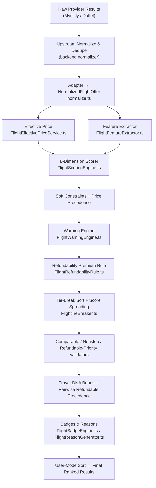

# FareMind Flight Ranking & Scoring Algorithm

> **Status:** authoritative — re-verified line-by-line against the implementation on **2026‑08‑01**.
> Every number below was read from source, not carried forward from the previous draft.
>
> **Authoritative code path:** `rankFlightOffers()` in [`engine.ts`](../src/lib/ai-scoring/engine.ts)
> + `scoreFlightOffer()` / `computeScoringStats()` in [`FlightScoringEngine.ts`](../src/lib/ai-scoring/FlightScoringEngine.ts).
> The legacy `aiRank()` path still exists in the same file but is **not** the current pipeline.

> ### ⚠️ This is one of two live ranking engines
>
> This document describes the **8-dimension** engine in `src/lib/ai-scoring/`. A separate
> **10-dimension** engine lives in `backend/src/ranking/` (mirrored to `src/lib/ranking/`) and is
> documented in [FLIGHT_RANKING_ENGINE.md](./FLIGHT_RANKING_ENGINE.md). They have different
> dimensions, different weights, and different config files. Which one runs depends on the trip type:
>
> | Search | Primary engine | Fallback |
> |---|---|---|
> | **Round trip** | 10-dimension (`rankFlightOffersV3`, backend `POST /api/ranking`) | 8-dimension, on backend failure |
> | **One way** | **8-dimension — the only path** | none |
>
> See [`src/app/api/search/route.ts`](../src/app/api/search/route.ts): round-trip calls the V3 engine
> inside a `try`, falling back to `rankFlightOffers()` in the `catch`; one-way calls
> `rankFlightOffers()` unconditionally. A change to this engine therefore affects **every one-way
> search** and round-trip searches only when the backend ranker is unreachable.

---

## 1. Architecture


```mermaid
flowchart TD
    A["Raw Provider Results<br/>(Mystifly / Duffel)"] --> B["Upstream Normalize & Dedupe<br/>(backend normalizer)"]
    B --> C["Adapter → NormalizedFlightOffer<br/>normalize.ts"]
    C --> D["Effective Price<br/>FlightEffectivePriceService.ts"]
    C --> E["Feature Extractor<br/>FlightFeatureExtractor.ts"]
    D --> F["8-Dimension Scorer<br/>FlightScoringEngine.ts"]
    E --> F
    F --> G["Soft Constraints + Price Precedence"]
    G --> H["Warning Engine<br/>FlightWarningEngine.ts"]
    H --> I["Refundability Premium Rule<br/>FlightRefundabilityRule.ts"]
    I --> J["Tie-Break Sort + Score Spreading<br/>FlightTieBreaker.ts"]
    J --> K["Comparable / Nonstop / Refundable-Priority Validators"]
    K --> L["Travel-DNA Bonus + Pairwise Refundable Precedence"]
    L --> M["Badges & Reasons<br/>FlightBadgeEngine.ts / FlightReasonGenerator.ts"]
    M --> N["User-Mode Sort → Final Ranked Results"]
```

### Upstream deduplication — what actually reaches this pipeline

Deduplication happens **upstream** in the backend normalizer, before offers reach scoring. The
AI-scoring `normalize.ts` only adapts shapes; it does not dedupe.

The dedup key in `mergeAndRankFlights()` ([`normalizer.ts`](../backend/src/services/normalizer.ts)) is:

```ts
`${airline.code}-${segments[0].departure.time}-${segments[0].departure.airport}-${totalPrice}-${refundable ? 'R' : 'NR'}`
```

**`segments[0]` is the first outbound segment only — the return journey is absent from the key.**
Two round trips sharing an outbound and a price collapse into one however different their return
flights are. Measured on DEL↔BOM, 23 Nov / 11 Dec 2026, 2 adults, economy:

| Provider cap | Priced fares | Distinct flights | After dedup | Collapsed |
|---|---:|---:|---:|---:|
| `TwoHundred` (production default) | 200 | 200 | **57** | 143 across 40 keys |
| `Thousand` (API maximum) | 1000 | 696 | **187** | 813 across 136 keys |

One observed key merged 8 genuinely different trips — same outbound `6E449`, eight different
returns, all at $88.88 — into a single card. Reproduce with
`npx tsx backend/scripts/trace-result-count.ts`.

Two compounding limits therefore cap what this engine ever sees:

1. `RequestOptions: TwoHundred` in [`mystifly.ts`](../backend/src/services/mystifly.ts) — the
   provider had 696 flights available and returned 200.
2. The dedup key above, which drops ~72% of what survives.

> **Not confirmed from repository:** whether the return-leg omission is deliberate anti-clutter
> behaviour or an oversight from when the key was written for one-way offers. The surrounding
> comment discusses only `branded` vs `lowest` data richness, which suggests the latter.

---

## 2. The 8 Scoring Dimensions

Each offer is scored 0–100 on 8 dimensions, then combined with a weighted sum into a **base score**.

| # | Dimension | Dom OW | Dom RT | Intl OW | Intl RT |
|---|-----------|:-----:|:-----:|:------:|:------:|
| 1 | **Effective Price** | 36% | 34% | 35% | 35% |
| 2 | **Duration** | 23% | 21% | 21% | 19% |
| 3 | **Stops** | 15% | 14% | 10% | 10% |
| 4 | **Baggage Value** | 10% | 11% | 12% | 13% |
| 5 | **Layover Quality** | 7% | 8% | 10% | 10% |
| 6 | **Schedule** | 4% | 5% | 4% | 5% |
| 7 | **Fare Flexibility** | 3% | 4% | 5% | 5% |
| 8 | **Provider Reliability** | 2% | 3% | 3% | 3% |

Source: `FLIGHT_SCORING_CONFIG` and `INTERNATIONAL_BASE_WEIGHTS` in
[`FlightScoringConfig.ts`](../src/lib/ai-scoring/FlightScoringConfig.ts).

**Multi-city** is defined and uses the round-trip weights verbatim (`MULTI_CITY` in
`FLIGHT_SCORING_CONFIG`, commented "Future: use round-trip weights as baseline"). There is no
international multi-city override — `INTERNATIONAL_BASE_WEIGHTS` is keyed only by
`ONE_WAY | ROUND_TRIP`.

> International routes reduce the **Stops** weight (1 stop is normal for long-haul) and boost
> **Baggage / Layover / Flexibility** (bigger real-world impact on international trips).
> A route is *international* when departure and arrival airports are in **different countries**
> (resolved from `src/data/airports.ts`).

### Dimension details

**1. Effective Price** — `clippedNorm` between the **p5** and **p95** of all candidate effective prices, ×100.
- Cheapest = 100 (explicit override when `effectiveTotalPrice <= minPrice`); most expensive → 0.
- **Guardrails:** within 3% of cheapest → floored at **93**; within 5% → floored at **88**;
  10–20% above → `−min((pctAbove − 0.10) × 60, 10)`; >20% above → `−min((pctAbove − 0.20) × 100, 25)`.
- **Effective price** = base fare **+ estimated checked-bag cost** when bags aren't included:
  **$35** domestic / **$75** international per piece × passengers × legs (round-trip = ×2).
  Skipped entirely if the user selected carry-on-only or the fare already includes checked bags.
  `carryOnIfNotIncluded` is **0** in both profiles — carry-on is never costed.

> Because the bag estimate keys off `checkedBagsIncluded === 0`, the accuracy of the upstream
> baggage parse moves a **34–36%** weighted dimension, not just the 10–13% baggage one. See §11.

**2. Duration** — `clippedNorm` between p5 and p95 of durations, ×100. Shortest = 100.

**3. Stops** — fixed table:

| Stops | 0 | 1 | 2 | 3 | 4 | 5+ |
|-------|:-:|:-:|:-:|:-:|:-:|:--:|
| Score | 100 | 85 | 72 | 58 | 45 | 30 |

**4. Baggage Value** — evaluated as an if/else chain in this order:

| Condition | Score |
|----------|:-----:|
| ≥2 checked **and** carry-on | 100 |
| 1 checked **and** carry-on | 90 |
| Carry-on, 0 checked | 70 |
| No carry-on, 0 checked — international | 42 |
| No carry-on, 0 checked — domestic | 50 |
| Checked > 0 but no carry-on stated | 60 |
| Fallback / unclear | 55 |

- Carry-on-only preference: closes 50% of the gap to 100 when no checked bag.
- Family / elderly preference: −10 when no checked bag.

**5. Layover Quality** — starts at 100 (nonstop returns 100 immediately). Per layover:

The four duration bands are an **else-if chain — exactly one applies**:

| Condition | Deduction |
|-----------|:---------:|
| < 75 min (intl) / < 45 min (dom) | −25 |
| < 90 min (intl) / < 60 min (dom) | −10 |
| > 480 min (8 h) | −30 |
| > 300 min (5 h) | −15 |

These three are **separate checks that stack** on top of whichever band applied:

| Condition | Deduction |
|-----------|:---------:|
| Overnight (`isOvernight` **or** > 600 min / 10 h) | −35 |
| Airport change | −30 |
| Self-transfer | −30 |

**6. Schedule Convenience** — starts at 100, deductions:

| Condition | Deduction |
|-----------|:---------:|
| Red-eye (dep ≥ 21:00 or < 01:00, **and** arr 04:00–09:00) | −10 (−15 if `avoidRedEye`) |
| Pre-dawn departure (00:00–06:00) | −8 (−12 for family/elderly) |
| Late arrival (≥ 23:00) | −8 |
| Very early arrival (00:00–05:00) | −6 intl / **−12 domestic** |

Applied to the outbound leg, and **again** to the return leg on round-trips — both legs stack into
the same 0–100 score.

**7. Fare Flexibility**

| Condition | Score |
|-----------|:-----:|
| Refundable + Changeable | 100 |
| Refundable only | 80 |
| Changeable only | 75 |
| Neither | 40 |
| ~~Unknown~~ | ~~60~~ — **unreachable, see below** |

- Firm-dates preference: +20 when score < 60 (in practice this only ever lifts 40 → 60).

> **The "Unknown → 60" branch is dead code.** `FareFlexibilityFeatures` declares
> `refundable: boolean` and `changeable: boolean`, so the four preceding branches are exhaustive and
> `else score = 60` can never execute. Worse, [`normalize.ts`](../src/lib/ai-scoring/normalize.ts)
> coerces with `?? false` at six sites, so a fare whose rules the provider never stated is scored as
> a definitive **"Neither" = 40** rather than a neutral 60 — and additionally attracts the
> `NON_REFUNDABLE_NON_CHANGEABLE` MAJOR warning (−6) plus compound stacking. This is the same
> unknown-becomes-denial defect fixed in the checkout path at `85f4ecb`; it has **not** been fixed
> here, because doing so moves live rankings and needs its own regression pass.

**8. Provider Reliability** — dynamic health metrics when available
(search 0.2 / revalidation 0.3 / booking 0.4 / latency 0.1), else static defaults:
**Duffel 95, Mystifly 90**, unknown 80.

---

## 3. Scoring Modes (weight multipliers)

Applied on top of the trip-type base weights, then **re-normalized to sum to 1.0**.
Dimensions not listed for a mode use multiplier 1.0. No mode adjusts Provider Reliability.

| Mode | Price | Duration | Stops | Baggage | Layover | Schedule | Flexibility |
|------|:----:|:-------:|:----:|:------:|:------:|:-------:|:----------:|
| **AI Pick** | 1.0 | 1.0 | 1.0 | 1.0 | 1.0 | 1.0 | 1.0 |
| **Best Value** | 1.2 | 1.1 | 1.0 | 1.0 | 1.0 | 1.0 | 1.0 |
| **Cheapest** | 1.6 | 0.7 | 0.7 | 0.6 | 1.0 | 1.0 | 1.0 |
| **Fastest** | 0.6 | 1.8 | 1.2 | 1.0 | 1.1 | 1.0 | 1.0 |
| **Fewest Stops** | 0.7 | 1.0 | 2.3 | 1.0 | 0.6 | 1.0 | 1.0 |
| **Comfort** | 0.6 | 1.0 | 1.4 | 1.4 | 1.5 | 1.5 | 1.0 |
| **Family** | 0.7 | 1.0 | 1.3 | 1.8 | 1.6 | 1.5 | 1.0 |
| **Elderly** | 0.7 | 1.2 | 1.8 | 1.3 | 1.7 | 1.6 | 1.0 |
| **Flexible Fare** | 0.7 | 0.8 | 1.0 | 1.0 | 1.0 | 1.0 | 3.0 |

### Price-weight floor
After normalization, if the **effective-price weight** falls below **`MIN_PRICE_WEIGHT_FRACTION = 0.30`**,
it is raised to 0.30 and the excess is redistributed proportionally from the non-price dimensions.
This guarantees price keeps ≥30% influence in **every** mode.

---

## 4. Soft Constraints & Price Precedence

> **Order matters:** these are applied to the **base score first**, and warning penalties are
> subtracted **afterward**:
> `finalScore = clamp(baseScore − warningPenalty − compoundWarningPenalty, 0, 100)`.

Applied to the base score (in order):

- **Over budget:** `−min(overPct × 30, 25)` (up to −25).
- **Over max duration:** `−min(overPct × 25, 20)` (up to −20).
- **Stops preference violated:** ×0.6 (nonstop pref + has stops), ×0.75 (1-stop pref + 2+ stops),
  ×0.80 (2-stop pref + 3+ stops).
- **Price Precedence Penalty:** when effective price exceeds the cheapest by more than
  **`thresholdPct` = 15%**, subtract `min((pctAbove − 0.15) × 50, 25)` (`rate` 50, `cap` 25).
  Applied **after** the weighted composite so it cannot be overcome by high non-price scores —
  lower fares always take precedence.

---

## 5. Warning Penalties

Warnings are generated after base scoring and deducted. The complete `NEGATIVE_PENALTY_MAP`
(**30 entries** — the previous draft listed 26):

| Warning key | Severity | Penalty |
|---------|----------|:-------:|
| `SELF_TRANSFER` | CRITICAL | −16 |
| `SUSPICIOUS_PRICE` (< 30% of cheapest) | CRITICAL | −16 |
| `AIRPORT_CHANGE` | CRITICAL | −15 |
| `PROVIDER_REVALIDATION_RISK` | CRITICAL | −15 |
| `TIGHT_CONNECTION` | CRITICAL | −14 |
| `EXTREME_DURATION` (>80% over fastest) | MAJOR | −9 |
| `OVERNIGHT_LAYOVER` | MAJOR | −7 |
| `THREE_OR_MORE_CONNECTIONS` | MAJOR | −7 |
| `SIGNIFICANTLY_LONGER_DURATION` (>40%) | MAJOR | −6 |
| `NON_REFUNDABLE_NON_CHANGEABLE` | MAJOR | −6 |
| `NO_CHECKED_BAG_INTERNATIONAL` | MEDIUM | −5 |
| `LONG_LAYOVER` | MEDIUM | −4 |
| `LOW_DATA_CONFIDENCE` | MEDIUM | −4 |
| `PAID_BAGGAGE_ONLY` | MEDIUM | −4 |
| `MUCH_HIGHER_THAN_COMPARABLE` (>30%) | MEDIUM | −4 |
| `TWO_CONNECTIONS` | MEDIUM | −4 |
| `VERY_INCONVENIENT_TIME` | MEDIUM | −4 |
| `LONGER_THAN_FASTEST` | MEDIUM | −3.5 |
| `NO_CHECKED_BAG_DOMESTIC` | MEDIUM | −3 |
| `NON_REFUNDABLE` | MEDIUM | −3 |
| `NON_CHANGEABLE` | MEDIUM | −3 |
| `HIGHER_THAN_COMPARABLE` (>20%) | MINOR | −2 |
| `LATE_NIGHT_ARRIVAL` | MINOR | −2 |
| `SLIGHTLY_LONG_LAYOVER` | MINOR | −2 |
| `SLIGHTLY_HIGHER_PRICE` (>10%) | MINOR | −1.5 |
| `EARLY_MORNING_DEPARTURE` | MINOR | −1.5 |
| `ONE_STOP_WHEN_NONSTOP_EXISTS` | MINOR | −1.5 |
| `FARE_RULES_UNKNOWN` | MINOR | −1.5 |
| `BAGGAGE_UNCLEAR` | MINOR | −1.5 |
| `SLIGHTLY_LONGER_THAN_FASTEST` | MINOR | −1.5 |

*Newly documented in this revision: `LONGER_THAN_FASTEST`, `VERY_INCONVENIENT_TIME`,
`BAGGAGE_UNCLEAR`, `SLIGHTLY_LONGER_THAN_FASTEST`.*

### Compound penalty (stacking)

Added on top of the summed per-warning points. **These clauses accumulate — they are not
alternatives:**

```ts
if (count >= 4) compound = 5; else if (count === 3) compound = 3; else if (count === 2) compound = 1.5;
if (majorCount >= 2)    compound += 2;
if (criticalCount >= 1) compound += 5;
if (criticalCount >= 2) compound += 8;   // stacks with the +5 above
```

- Warning count: 2 → **+1.5**, 3 → **+3**, 4+ → **+5** (mutually exclusive)
- ≥2 MAJOR → **+2**
- ≥1 CRITICAL → **+5**
- ≥2 CRITICAL → **a further +8, i.e. +13 total from the CRITICAL clauses**

> **Correction:** the previous draft read "≥1 CRITICAL → +5, ≥2 CRITICAL → +8", implying the larger
> value replaces the smaller. It does not — `compound += 8` follows `compound += 5`. An offer with
> 2 CRITICAL and 4+ total warnings takes 5 + 5 + 8 = **18** compound points before its per-warning
> penalties are counted.

---

## 6. AI Pick Eligibility

A flight qualifies for the **AI Pick** badge when:
- `finalScore ≥ AI_PICK_MIN_SCORE` (**85**), **and**
- no AI-pick-blocking warning is present. The blocking warnings are all CRITICAL:
  self-transfer, airport change, tight connection, provider revalidation risk, suspicious price.

Only the single top-ranked offer at the maximum score receives the badge.

---

## 7. Refundability Handling

Two cooperating mechanisms, configured by `REFUNDABILITY_CONFIG` in
[`FlightRefundabilityRule.ts`](../src/lib/ai-scoring/FlightRefundabilityRule.ts)
(`enabled: true`, `minPremiumPct: 0`, `maxPremiumPct: 20`, `maxDurationDifferencePct: 35`,
`maxStopDifference: 1`).

**a) Refundability Premium Rule** — for each refundable fare, find the single most comparable
**changeable-only** fare (same cabin/currency; exact stop match preferred, else ±1 stop within 35%
duration). Adjustment = `premiumBand × comparabilityFactor`, applied to the score **before** warnings:

- Premium bands (refundable's % premium over the comparable): ≤5% → +15, ≤10% → +12, ≤15% → +8, ≤20% → +5.
- Overpricing bands: ≤35% → −3, ≤50% → −5, >50% → −8.
- Comparability factors: same stops & ≤15% dur → 1.00; same stops & 15–35% → 0.85;
  +1 stop & ≤20% → 0.75; +1 stop & 20–35% → 0.60.

**b) Pairwise Refundable Precedence** ([`FlightPairwisePrecedenceService.ts`](../src/lib/ai-scoring/FlightPairwisePrecedenceService.ts))
— a **position-only** move (no score change): a qualifying refundable fare is moved to sit
**immediately above** its matched changeable comparator if it ranked below it. Never forced into any
Top-N window; skipped if it carries a CRITICAL warning.

---

## 8. Full Ranking Pipeline — `rankFlightOffers()`

Step numbering matches the comment markers in [`engine.ts`](../src/lib/ai-scoring/engine.ts).

1. **Adapt** each offer to `NormalizedFlightOffer`.
2. **Effective price** — add estimated bag costs.
3. **Feature extraction** — layovers, schedule hours, stops, baggage, flexibility, international flag.
4. **Quality filter** — drop offers with missing price/duration, any layover **< `MIN_LAYOVER_MINUTES` = 45 min**, or total duration **> 2× the fastest**.
5. **Scoring stats** — p5/p95, min/max for price & duration. When cabin-class filters are active and ≥3 offers qualify, stats are computed **within the selected cabin** so business isn't scored against economy.
6. **Score** every candidate (8 dimensions → base → soft constraints → price precedence → warnings → final).
   - **6.5 Refundability Premium Rule.**
7. **Tie-break sort** — primary by `finalScore`; when within 2 points: fewer CRITICAL warnings → fewer MAJOR warnings → lower effective price (>2%) → *(intl: shorter duration then fewer stops / domestic: fewer stops then shorter duration)* → better baggage → better flexibility → better provider reliability → earlier departure.
8. **Score spreading** — enforce at least a **1-point gap** between consecutively ranked offers (so the list isn't all "100").
   - **8.5 Comparable-offer validation** — a cheaper comparable offer must rank ≥ a pricier one unless a justified premium exists (better baggage / flexibility / meaningfully better duration or schedule / provider risk on the cheaper one).
   - **8.55 Comparable nonstop low-fare validation** (AI Pick / Best Value / Cheapest).
   - **8.58 Fully-refundable priority validation** (AI Pick / Best Value).
   - **8.6 Re-sort** after the above adjustments.
   - **8.7 Travel-DNA bonus** — additive only: airline match up to **+5**, cabin up to **+3**, stops up to **+2** (max **+10**), then re-sort.
   - **8.9 Pairwise refundable precedence** — final position-only move.
9. **Badges** — AI Pick, Cheapest (by displayed fare), Fastest, Fewest Stops, Nonstop, Best Value, Baggage Included, Flexible Fare, Best Refundable Value, plus warning tags.
10. **Reasons** — up to 3–4 positives + all negative warnings (capped at 5 total).
11. **User-mode sort** — if the user picked **Cheapest** or **Fastest**, a final hard sort by raw price / duration overrides the Best-Value ordering. (Fewest-Stops / Flexible-Fare are expressed through weights, not a final re-sort.)

> The legacy `aiRank()` entry point in the same file uses an abbreviated 8-step flow (quality filter →
> stats → score → tie-break → spreading → tags → reasons → user sort) with none of the 8.5–8.9 layers.
> It is not the current pipeline.

---

## 9. Result-count limits — where "N of M" comes from

There are **three separate values** for the "AI recommendation limit" concept, and they disagree:

| Location | Value | Status |
|---|---:|---|
| `DEFAULT_AI_RECOMMENDATION_LIMIT` in `FlightScoringConfig.ts` | 51 | imported into `engine.ts` but **never referenced** — dead import |
| `DEFAULT_AI_RECOMMENDATION_LIMIT` in `api/config/ai-recommendation-limit/route.ts` | 25 | a separate local constant, DB-backed via `SystemConfig` |
| Hardcoded literal in `search/page.tsx` (two sites) | 51 | what the UI label actually uses |

The search header renders:

```tsx
`AI-scored · ${Math.min(panelFilteredRT.length, 51)} of ${panelFilteredRT.length} results`
```

So **"AI-scored · 51 of 73 results" does not mean 51 of 73 were scored.** All 73 were scored and
ranked; 51 is a hardcoded literal in the label string, and no slice is applied to the ranked list at
that point. `DEFAULT_DEEP_EXPLANATION_LIMIT = 20`, `DEFAULT_CHATBOT_CONTEXT_LIMIT = 51` and
`MAX_AI_RECOMMENDATION_LIMIT = 100` are also defined but unused by this pipeline.

---

## 10. Key Files

| File | Purpose |
|------|---------|
| [`engine.ts`](../src/lib/ai-scoring/engine.ts) | `rankFlightOffers()` — full pipeline orchestrator |
| [`FlightScoringEngine.ts`](../src/lib/ai-scoring/FlightScoringEngine.ts) | `scoreFlightOffer()` — 8-dimension scorer + stats |
| [`FlightScoringConfig.ts`](../src/lib/ai-scoring/FlightScoringConfig.ts) | Weights, mode multipliers, penalty map, price-precedence constants |
| [`FlightScoringTypes.ts`](../src/lib/ai-scoring/FlightScoringTypes.ts) | `ScoringFeatures`, `FareFlexibilityFeatures`, warning types |
| [`FlightFeatureExtractor.ts`](../src/lib/ai-scoring/FlightFeatureExtractor.ts) | Extract trip-type-aware features |
| [`FlightEffectivePriceService.ts`](../src/lib/ai-scoring/FlightEffectivePriceService.ts) | Effective price incl. estimated bag costs |
| [`FlightWarningEngine.ts`](../src/lib/ai-scoring/FlightWarningEngine.ts) | Warning generation + per-warning & compound penalties |
| [`FlightRefundabilityRule.ts`](../src/lib/ai-scoring/FlightRefundabilityRule.ts) | Refundability premium adjustment |
| [`FlightComparableFareMatcher.ts`](../src/lib/ai-scoring/FlightComparableFareMatcher.ts) | 2-level comparable-fare matcher |
| [`FlightTieBreaker.ts`](../src/lib/ai-scoring/FlightTieBreaker.ts) | Tie-break comparator + score spreading |
| [`FlightComparableValidator.ts`](../src/lib/ai-scoring/FlightComparableValidator.ts) | Cheaper-comparable consistency |
| [`FlightComparableNonstopValidator.ts`](../src/lib/ai-scoring/FlightComparableNonstopValidator.ts) | Cheaper-nonstop consistency |
| [`FlightRefundablePriorityValidator.ts`](../src/lib/ai-scoring/FlightRefundablePriorityValidator.ts) | Refundable-tier precedence |
| [`FlightPairwisePrecedenceService.ts`](../src/lib/ai-scoring/FlightPairwisePrecedenceService.ts) | Position-only refundable-over-changeable move |
| [`FlightProviderReliabilityService.ts`](../src/lib/ai-scoring/FlightProviderReliabilityService.ts) | Provider reliability score |
| [`FlightBadgeEngine.ts`](../src/lib/ai-scoring/FlightBadgeEngine.ts) | Badges & tags |
| [`FlightReasonGenerator.ts`](../src/lib/ai-scoring/FlightReasonGenerator.ts) | Human-readable reasons |
| [`normalize.ts`](../src/lib/ai-scoring/normalize.ts) | Provider types → `NormalizedFlightOffer` |
| [`quality-filter.ts`](../src/lib/ai-scoring/quality-filter.ts) | `MIN_LAYOVER_MINUTES`, duration sanity filter |
| [`FlightScoringUtils.ts`](../src/lib/ai-scoring/FlightScoringUtils.ts) | `clamp`, `percentile`, `clippedNorm`, `hourFromIso`, `isInternationalRoute` |
| [`feature-flags.ts`](../src/lib/feature-flags.ts) | `RANKING_INPUT_CORRECTION` gate + legacy-input reproduction |

---

## 11. Scoring inputs and the `RANKING_INPUT_CORRECTION` flag

The fare-family work (`d834dd5`) changed **what this engine is fed**, without touching a single
scoring formula, weight, threshold or badge rule. Two inputs were corrected upstream:

| Input | Before | After |
|---|---|---|
| `baggage.checked` | `kg >= 20 ? 1 : 0` — a real 15Kg allowance read as **no bag** | any weight > 0 is one allowance |
| `comfort.fareClassName` *(10-dimension engine only)* | hardcoded `undefined` | the airline's fare family |

For **this** engine only the baggage correction applies — there is no comfort dimension here. But it
lands twice: on **Baggage Value** (10–13%) and, via the `checkedBagsIncluded === 0` bag-cost
estimate, on **Effective Price** (34–36%). Correcting a 15Kg fare removes a phantom $35/$75 per
piece, per passenger, per leg.

`RANKING_INPUT_CORRECTION` (default **OFF**) gates this. When off, `withLegacyBaggage()` restores the
pre-fix count at **every** entry point into a ranker — the 10-dimension input mapping, the one-way
call, and the round-trip fallback — so rankings are byte-identical to before the change. Display
always uses the corrected values and never reads the flag.

Evidence, re-runnable against live provider data:

```bash
cd backend
npx tsx scripts/fare-family-regression.ts --all   # before/after, per dimension + badges
npx tsx scripts/fare-family-attribution.ts        # exits non-zero on any unexplained delta
npx tsx scripts/trace-result-count.ts             # where provider fares go
```

Delete the flag, `legacyCheckedBags()` and `withLegacyBaggage()` once the corrected ranking is signed
off in production.

---

## 12. Known defects in this engine

Documented, **not** fixed — each would move live rankings and needs its own regression pass.

1. **Unknown fare rules are scored as a denial.** `normalize.ts` coerces `refundable`/`changeable`
   with `?? false` at six sites, so provider silence becomes "Neither" (40) instead of the intended
   neutral 60, and additionally triggers `NON_REFUNDABLE_NON_CHANGEABLE` (−6). The `else score = 60`
   branch is unreachable dead code. See §2 dimension 7.
2. **Return leg absent from the upstream dedup key**, collapsing ~72% of surviving fares on a
   measured round-trip search. See §1.
3. **Provider result cap.** `RequestOptions: TwoHundred` returns 200 of 696 available flights on a
   measured route, and at that cap zero flights come back with more than one fare family — so the
   airline's fare ladder is truncated away before scoring. See §1.
4. **Three conflicting recommendation-limit constants** and a hardcoded `51` in the UI label that
   misreports how many offers were scored. See §9.

---

## 13. Change Log

**2026‑08‑01 — full re-verification against source**

Verified unchanged and correct: all 8 dimension weights (domestic + international, OW + RT), all 9
mode multipliers, `MIN_PRICE_WEIGHT_FRACTION` 0.30, `PRICE_PRECEDENCE_PENALTY` (15% / rate 50 /
cap 25), the stops table, the baggage table, layover and schedule deductions, price guardrails
(93/88 floors, −10 and −25 bands), `AI_PICK_MIN_SCORE` 85, `ESTIMATED_BAG_COSTS` ($35/$75),
`MIN_LAYOVER_MINUTES` 45, the refundability premium and overpricing bands, the comparability
factors, and the step ordering of the pipeline.

Corrected in this revision:

- **Warning table was incomplete** — 26 of 30 entries. Added `LONGER_THAN_FASTEST` (MEDIUM −3.5),
  `VERY_INCONVENIENT_TIME` (MEDIUM −4), `BAGGAGE_UNCLEAR` (MINOR −1.5) and
  `SLIGHTLY_LONGER_THAN_FASTEST` (MINOR −1.5).
- **Compound CRITICAL penalties stack.** The previous draft implied ≥2 CRITICAL scored +8; it is
  +5 **and** +8 = +13.
- **"Unknown → 60" flexibility score is unreachable**, and `?? false` upstream turns unknown into a
  −6 MAJOR warning plus a 40 score.
- **Layover deductions clarified** — the four duration bands are mutually exclusive (else-if);
  overnight / airport-change / self-transfer stack on top.
- **Added §1 dedup detail** with measured counts, **§9** on the three conflicting result-count limits
  and the misleading UI label, **§11** on the `RANKING_INPUT_CORRECTION` flag, and **§12** a
  consolidated defect register.
- **Added the two-engine banner** — this engine is the *only* path for one-way searches and the
  fallback for round trips; the 10-dimension engine is primary for round trips.
- Noted multi-city uses round-trip weights and has no international override.

**2026‑07‑20 — correctness fixes**

- **International detection now country-based.** `isInternationalRoute()` resolves each airport's
  country from `src/data/airports.ts` and returns *international* only when the countries differ.
  Previously a US-only IATA set classified **every** non-US-domestic route (e.g. DEL→BOM, LHR→EDI)
  as international, applying the wrong weight profile, bag estimate, and layover thresholds. A single
  shared implementation now lives in `FlightScoringUtils.ts`; the divergent duplicate in `normalize.ts`
  was removed.
- **Timezone-safe local-hour extraction.** `hourFromIso()` now reads the wall-clock hour directly from
  the timestamp's time component instead of `new Date(iso).getHours()`, so red-eye / early-departure /
  late-arrival scoring is independent of the server timezone and robust to offset-bearing strings.

**Documentation corrections vs. the pre-07-20 draft**

- Soft constraints are applied **before** warning penalties (the earlier draft said "after").
- Added the previously-undocumented layers: price-precedence penalty, 0.30 price-weight floor,
  compound warning penalty, the three comparable validators, the refundability premium rule + pairwise
  precedence, Travel-DNA bonus, score spreading, and the final user-mode sort.
- Corrected the Schedule table (domestic very-early-arrival is −12, not just intl −6).
