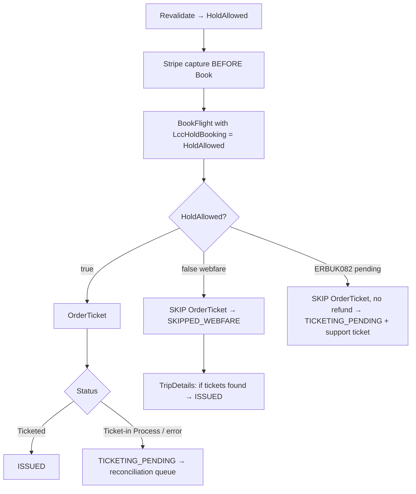

# HOLD_ALLOWED_ANALYSIS.md

> Detailed analysis of the `HoldAllowed` flag and its two booking flows. Derived from repository source. Unconfirmed items marked **Not confirmed from repository.**

## Purpose

`HoldAllowed` is the single most consequential branch in the Mystifly booking flow. It determines whether FareMind must call `OrderTicket` after `BookFlight`, and *when* the provider debits the agency balance. This document captures exactly what the code does today, the business meaning, the data mapping, and the known gaps.

## Business meaning

Mystifly returns `HoldAllowed` on the **Revalidate** response. It signals whether the fare permits a hold (book now, issue ticket later) or must be instantly purchased.

- **`HoldAllowed = true` (Hold booking):** the itinerary can be booked and held; ticketing (and the provider debit) happen at a separate `OrderTicket` step.
- **`HoldAllowed = false` (Webfare / instant purchase):** the fare must be purchased at `BookFlight`; there is no separate ticketing step — the provider debits the agency balance at `BookFlight`.

> **Do NOT assume a 24-hour hold window.** The repository does **not** define a hold duration from the provider. `ProviderHoldRule.holdDurationMinutes` defaults to `60` and `ProviderFareInventoryRule.holdDurationMinutes` is nullable — these are **admin-configured local rules**, not values returned by Mystifly. The actual carrier hold window is **Not confirmed from repository.**

## Where the flag comes from

1. **Revalidate response** — `revalidateFlight` reads `Data.HoldAllowed` ([`mystifly.ts` L644-655](../backend/src/services/mystifly.ts#L644)).
2. **Checkout reads it** — `holdAllowed` extracted at [`confirm/route.ts` L1101-1102](../src/app/api/checkout/bookings/confirm/route.ts#L1101).
3. **Propagates to Book** — `holdBooking: holdAllowed` → `/api/mystifly/book` body → [`mystifly-booking.ts` L337](../backend/src/routes/mystifly-booking.ts#L337) → `mystifly.bookFlight({holdBooking})` → `LccHoldBooking: params.holdBooking || false` ([`mystifly.ts` L693](../backend/src/services/mystifly.ts#L693)).

`LccHoldBooking` is the **only** hold-related field in the Book request per the swagger.

## Current implementation

### HoldAllowed = true (confirm/route.ts L1327-1356)
- Calls `/api/mystifly/order-ticket`.
- Response `"Ticket-in Process"` → `TICKETING_PENDING`; otherwise `ISSUED`.
- Any error is **non-blocking** → `TICKETING_PENDING` (queued for the reconciliation worker). The customer is not refunded on a transient OrderTicket error because the booking exists.

### HoldAllowed = false / Webfare (confirm/route.ts L1357-1360)
- `ticketingStatus = 'SKIPPED_WEBFARE'`. **No OrderTicket call.**
- Comment: "Webfare — payment was debited at BookFlight, no OrderTicket needed."
- TripDetails (step 6) may still upgrade to `ISSUED` when ticket numbers appear.

### Payment timing (both flows)
Stripe customer capture happens at **Step 3, before BookFlight** (confirm/route.ts L1155-1178), unconditionally for Mystifly, because Mystifly debits the agency balance at BookFlight. This differs from Duffel (capture after order).

| | HoldAllowed=true | HoldAllowed=false (webfare) |
|---|---|---|
| `LccHoldBooking` | true | false |
| Stripe capture | before Book | before Book |
| Provider debit | at OrderTicket | at BookFlight |
| OrderTicket | yes | no |
| Post-book ticketing status | ISSUED / TICKETING_PENDING | SKIPPED_WEBFARE → ISSUED |

## Provider responses

- Revalidate: `IsValid`, `HoldAllowed`, revalidated `FareSourceCode`, fare/currency.
- Book: `Data.UniqueID` (MFRef), `Data.Status`, or `Data.Error{ErrorCode,ErrorMessage}` (incl. ERBUK082).
- OrderTicket: `Data.Status` (e.g. `"Ticketed"`, `"Ticket-in Process"`).
- AirTicketOrderStatus / TripDetails: ticket numbers + status for reconciliation.

## Database mapping

| Concept | Field |
|---|---|
| Search FSC | `MasterBooking.searchFareSourceCode` |
| Revalidated FSC | `MasterBooking.revalidatedFareSourceCode` |
| MFRef | `MasterBooking.mystiflyMfRef` |
| Hold rules (admin) | `ProviderHoldRule.holdAllowed` / `holdDurationMinutes` (default 60); `ProviderFareInventoryRule.holdAllowed` / `holdDurationMinutes` (nullable) |
| Ticketing status | `MasterBooking.ticketingStatus` (`MbTicketingStatus`) |
| Reconciliation | `TicketingReconciliation` |

Note the checkout uses the **Revalidation `HoldAllowed`** flag at runtime, not the admin `ProviderHoldRule`/`ProviderFareInventoryRule` (those carry a `holdAllowed` for search config; whether they gate anything at book time is **Not confirmed from repository**).

## Frontend flow

The frontend does not choose the flow — it sends the selected fare + alternates to `confirm/route.ts`, which revalidates and reads `HoldAllowed`. The UI surfaces a pending state when the response includes `ticketingPending` (confirm response L2291). See [FRONTEND_ARCHITECTURE.md](./FRONTEND_ARCHITECTURE.md).

## Known gaps / unknowns

- **Hold duration is unknown.** No provider-returned hold window; local rules default to 60 min. **Not confirmed from repository.**
- **No auto-ticketing of held bookings on a timer.** There is no scheduler that issues `OrderTicket` for held bookings before a hold expires — the reconciliation worker only *polls status*, it does not *issue* tickets. **Not confirmed** whether held-but-unticketed bookings are auto-cancelled by Mystifly.
- **Webfare cannot be predicted pre-revalidation** — see [PUBLIC_PRIVATE_WEBFARE.md](./PUBLIC_PRIVATE_WEBFARE.md).
- Admin hold rules (`ProviderHoldRule`) exist but their enforcement point at book time is **Not confirmed from repository.**

## Future implementation ideas

- Persist the revalidated `HoldAllowed` and a computed hold-expiry on the booking, and add a scheduler that issues `OrderTicket` (or cancels) before expiry for held bookings.
- Surface hold expiry to the customer/agent UI.
- Wire `ProviderHoldRule` into the book-time decision if business wants to override provider behavior.

## Related docs

[MYSTIFLY_BOOKING_FLOW.md](./MYSTIFLY_BOOKING_FLOW.md) · [TICKETING_FLOW.md](./TICKETING_FLOW.md) · [PUBLIC_PRIVATE_WEBFARE.md](./PUBLIC_PRIVATE_WEBFARE.md) · [PAYMENT_FLOW.md](./PAYMENT_FLOW.md)
