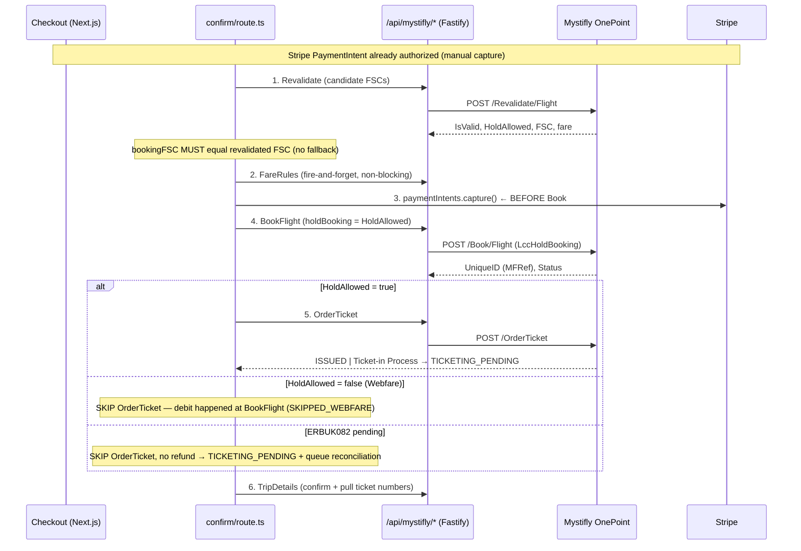

# MYSTIFLY_BOOKING_FLOW.md

> **The single most important integration document.** Everything below is derived from repository source. Items that could not be confirmed are marked **Not confirmed from repository.**
>
> Swagger reference: `https://restapidemo.myfarebox.com/api/docs/v1/swagger.json` (demo/test environment).

## Purpose

Document the complete Mystifly OnePoint REST integration: search, revalidation, fare rules, booking, ticket issuing, the two booking flows (`HoldAllowed` true/false), provider references, state machines, reconciliation, post-ticketing (void/refund/reissue), cancellation, failure handling, retries, and idempotency.

## Overview

- **Low-level client:** [`backend/src/services/mystifly.ts`](../backend/src/services/mystifly.ts) — every HTTP call goes through `mystiflyRequest<T>()` ([L403-484](../backend/src/services/mystifly.ts#L403)), which prepends `MYSTIFLY_API_URL` (default `https://restapidemo.myfarebox.com`) and attaches `Authorization: Bearer <token>`.
- **Fastify proxy routes:** [`backend/src/routes/mystifly-booking.ts`](../backend/src/routes/mystifly-booking.ts) and [`backend/src/routes/mystifly-ptr.ts`](../backend/src/routes/mystifly-ptr.ts) expose `/api/mystifly/*` for the Next.js frontend.
- **Search normalization:** [`backend/src/services/normalizer.ts`](../backend/src/services/normalizer.ts) `normalizeMystiflyOffer`, plus [`backend/src/providers/mystifly/*`](../backend/src/providers/mystifly/) (search-resolver, status-mapper, errors, audit).
- **Checkout orchestration:** [`src/app/api/checkout/bookings/confirm/route.ts`](../src/app/api/checkout/bookings/confirm/route.ts), Mystifly branch starting L973.
- **Reconciliation worker:** [`backend/src/workers/ticketing-reconciliation.ts`](../backend/src/workers/ticketing-reconciliation.ts) + cron.

## API endpoint catalogue

All in [`backend/src/services/mystifly.ts`](../backend/src/services/mystifly.ts):

| Endpoint | HTTP | Path | Function (line) | Request | Key response fields |
|---|---|---|---|---|---|
| CreateSession | POST | `/api/CreateSession` | `createSession` (L335) | `{UserName,Password,AccountNumber}` | `SessionId`/`TokenId` (many fallbacks) |
| Search | POST | `/api/{v1\|v2\|v2.2}/Search/Flight` | `searchFlights` (L601) | `MystiflySearchRQ` | `PricedItineraries` / v2.2 ref-lists |
| Revalidate | POST | `/api/v1/Revalidate/Flight` | `revalidateFlight` (L644) | `{FareSourceCode,Target}` | `IsValid`, `HoldAllowed`, FSC, fare |
| FareRules | POST | `/api/v1/FlightFareRules` | `getFareRules` (L768) | `{FareSourceCode,UniqueID?,Target}` | fare rules |
| Book | POST | `/api/v1/Book/Flight` | `bookFlight` (L680) | `MystiflyBookRQ` incl. `LccHoldBooking` | `Data.UniqueID`, `Data.Status`, errors |
| OrderTicket | POST | `/api/v1/OrderTicket` | `orderTicket` (L716) | `{UniqueID,FareSourceCode?,Target,ClientReferenceNo?}` | `Data.Status` |
| AirTicketOrderStatus | POST | `/api/v1/AirTicketOrderStatus` | `getTicketOrderStatus` (L792) | `{UniqueID,Target}` | `TktStatus`/`Status`, `TicketNumbers` |
| TripDetails | GET | `/api/v3/TripDetails/{mfRef}` | `getTripDetails` (L812) | URL param | `CustomerInfos[].ETicketNumbers` |
| RetrieveMFRefThroughFSC | GET | `/api/RetrieveMFRefThroughFSC/{fsc}` | `getMfRefFromFsc` (L826) | URL param | `MFRef`/`UniqueID` |
| Booking/Cancel | POST | `/api/v1/Booking/Cancel` | `cancelBooking` (L745) | `{UniqueID,Target}` | errors + `Status` |
| SeatMap | POST | `/api/v1/SeatMap/Flight` | `getSeatMap` (L852) | `{FareSourceCode,Target}` | seat map (errors → `null`) |
| AncillaryServiceRequest | POST | `/api/AncillaryServiceRequest` | `getAncillaryServices` (L895) | `{MFRef,isBaggage,isMeal,isSeatMap,isConfirmed?,isCancel?,ServiceKey?,SeatMapKey?}` | `BaggageServices`/`MealServices`/`SeatMapData` |
| BookingNotes | POST | `/api/v2/BookingNotes` | `addBookingNotes` (L953) | `{UniqueID,Notes[],Target}` | — |
| StructuredFareRule | POST | `/api/v1/StructuredFareRule` | `getStructuredFareRule` (L974) | `{SFRKey,Target}` | — |
| PostTicketingRequest | POST | `/api/PostTicketingRequest` | `postTicketingRequest` (L1007) + void/refund/reissue helpers | `{mFRef,ptrType,...}` (lowercase keys) | PTR record |
| Search/PostTicketingRequest | POST | `/api/Search/PostTicketingRequest` | `searchPtrStatus` (L1035) | `{UniqueID,Target}` | PTR status |
| MarkAsRead | POST | `/api/MarkAsRead` | `markPtrAsRead` (L1053) | `{UniqueID,Target}` | — |

Search request notes: departure date mapped to `${date}T00:00:00` (L589); `AirTripType` via `resolveAirTripType` (OneWay/Return/Circle/OpenJaw, L560); version path also in [`mystifly.search-resolver.ts`](../backend/src/providers/mystifly/mystifly.search-resolver.ts) `getSearchApiPath` (L120).

## The booking flow — end to end

The checkout Mystifly branch is labelled a "4-step flow: Revalidate → Stripe Capture → BookFlight → OrderTicket" ([confirm/route.ts:967](../src/app/api/checkout/bookings/confirm/route.ts#L967)) but implements 6 labelled steps:

### Step-by-step (confirm/route.ts)

1. **Revalidate** (L989-1074) — loops candidate FareSourceCodes calling `/api/mystifly/revalidate`, extracts `isValid` and `holdAllowed` (L1101-1102). See **Alternate-FSC recovery** below for the loop.
2. **Bind FSC** (L1104-1125) — `bookingFareSourceCode = revalidatedFareSourceCode`; it **must** equal the Revalidate output. No silent fallback to the search FSC.
3. **FareRules** (L1138-1153) — fire-and-forget `/api/mystifly/fare-rules`, non-blocking.
4. **Stripe capture** (L1155-1178) — `stripe.paymentIntents.capture(paymentIntentId)` called **BEFORE** BookFlight, unconditionally for Mystifly. Rationale (comments L970-972, L1155): "Mystifly debits agency balance at BookFlight, so we must guarantee customer payment before creating the provider booking." Sets `mystiflyPaymentCaptured = true`.
5. **BookFlight** (L1180-1310) — POST `/api/mystifly/book` with `holdBooking: holdAllowed` (L1192). If it fails *after* capture → Stripe refund (L1273-1285). Returns `UniqueID` (MFRef).
6. **OrderTicket / branch** (L1312-1360):
   - **HoldAllowed = true** (L1327-1356): call `/api/mystifly/order-ticket`. Response `"Ticket-in Process"` → `TICKETING_PENDING`; else `ISSUED`. Any error is **non-blocking** → `TICKETING_PENDING` (queued for reconciliation).
   - **HoldAllowed = false / Webfare** (L1357-1360): `ticketingStatus = 'SKIPPED_WEBFARE'`. **No OrderTicket call** — payment was debited at BookFlight.
   - **ERBUK082 pending** (L1317-1326): OrderTicket skipped, `TICKETING_PENDING`, **no refund**.
7. **TripDetails** (L1367-1396) — `/api/mystifly/trip-details` to confirm and pull ticket numbers; if tickets found while status was PENDING/SKIPPED_WEBFARE → upgrade to `ISSUED` (L1381-1387).

### HoldAllowed = true vs false (summary)

| | HoldAllowed = true (Hold booking) | HoldAllowed = false (Webfare / instant) |
|---|---|---|
| `LccHoldBooking` sent to Book | `true` | `false` |
| OrderTicket called? | **Yes** — issues ticket & debits | **No** — skipped |
| Provider debit timing | At OrderTicket | At BookFlight |
| Stripe customer capture | Before BookFlight (both) | Before BookFlight (both) |
| Ticketing status after book | `ISSUED` or `TICKETING_PENDING` | `SKIPPED_WEBFARE` → upgraded to `ISSUED` on TripDetails |

The `holdBooking` flag propagates: `confirm/route.ts` → `/api/mystifly/book` body `holdBooking` → [`mystifly-booking.ts` L337](../backend/src/routes/mystifly-booking.ts#L337) → `mystifly.bookFlight({holdBooking})` → `LccHoldBooking: params.holdBooking || false` ([`mystifly.ts` L693](../backend/src/services/mystifly.ts#L693)). See [HOLD_ALLOWED_ANALYSIS.md](./HOLD_ALLOWED_ANALYSIS.md).

## Public / Private / Webfare

- **Search `PricingSourceType`**: `MystiflyPricingSource = 'Public' | 'Private' | 'All'` ([`mystifly.ts` L48](../backend/src/services/mystifly.ts#L48)); default `'All'` (L608). `toPricingSourceType(fareType)` maps `private→Private`, `public→Public`, else `All` (search-resolver L132).
- **`fareSource` on UnifiedFlight**: derived in `normalizeMystiflyOffer` ([normalizer L380-391](../backend/src/services/normalizer.ts#L380)) from `FareType`/`pricingInfo.FareType`, lowercased → `'private'`/`'public'`/`undefined`. (Recent commit `964a240`.)
- **Webfare has no dedicated field.** The `[Mystifly][FareTypeDiag]` block ([orchestrator L363-386](../backend/src/services/orchestrator.ts#L363)) is a *discovery probe* (probes `IsWebFare`, `WebFare`, `WebFareType`, `FareType`, `ContentType`, `SupplierType`, `Supplier`, `IsLcc`, `FareSource`). **No code maps any field to a webfare flag.** Operationally, "webfare" is inferred purely from `HoldAllowed = false` at revalidation. Full detail in [PUBLIC_PRIVATE_WEBFARE.md](./PUBLIC_PRIVATE_WEBFARE.md).

## Provider references

| Reference | Origin | Stored as |
|---|---|---|
| **FareSourceCode (FSC)** | Search itineraries (`FareSourceCode`/`AirItineraryPricingInfo.FareSourceCode`) | `UnifiedFlight.providerOfferId`; `MasterBooking.searchFareSourceCode` / `revalidatedFareSourceCode` |
| **MFRef / UniqueID** | BookFlight `Data.UniqueID`; if pending, recovered via `getMfRefFromFsc` → RetrieveMFRefThroughFSC | `MasterBooking.mystiflyMfRef`, `providerOrderId`; doubles as `masterPnr` |
| **PNR** | `masterPnr = duffelOrder?.booking_reference \|\| mystifly uniqueId \|\| generateRef()` ([confirm L1458](../src/app/api/checkout/bookings/confirm/route.ts#L1458)) | `MasterBooking.masterPnr` |
| **TicketNumbers** | AirTicketOrderStatus (`TicketNumbers`/`ETicketNumbers`) and TripDetails (`CustomerInfos[].ETicketNumbers`) | `BookingTicket.ticketNumber`, `TicketingReconciliation.ticketNumbers[]` |

FSC traceability: `hashFsc` (SHA-256, first 16 chars) logs `searchFscHash`/`bookFscHash`/`revalFscHash` ([mystifly-booking.ts L33-35](../backend/src/routes/mystifly-booking.ts#L33)).

## ERBUK082 — "Pending Need / Awaiting carrier response / Booking Unconfirmed"

**This is a valid PENDING workflow, not a failure.** In the Mystifly demo environment (synthetic data), revalidation/booking often returns ERBUK082 when the itinerary changed or seats became unavailable.

**Detection** ([`mystifly-booking.ts` L352-381](../backend/src/routes/mystifly-booking.ts#L352)): `pendingUnconfirmed = /ERBUK082/i.test(errCode) || /booking unconfirmed|awaiting carrier|pending need/i.test(errMsg)`. If matched, resolve `mfRef` (from `Data.UniqueID` else `getMfRefFromFsc`) and return **HTTP 200** with `{success:false, pending:true, uniqueId, status:'Pending', errorCode:'MYSTIFLY_BOOKING_PENDING'}`. If no ref resolvable → hard 422.

**Pending workflow** (confirm route):
- `bookPending = bookData.pending === true && !!bookData.uniqueId` (L1261) → the failure/refund branch is **skipped** (L1263).
- Booking persisted; `ticketingStatus = 'TICKETING_PENDING'`, `erbuk082 = true`. OrderTicket skipped. **Card is NOT refunded** (L1318-1321) — booking treated as valid & paid, then reconciled.
- After the MasterBooking row exists: `queueForReconciliation({bookingId, providerUniqueId, fareSourceCode})` (L2132-2145).

**Support ticket** (L2147-2187): creates `SupportTicket` with `category:'ERBUK082'`, `queue:'TICKETING_PENDING_QUEUE'`, `ticketType:'TICKETING_PENDING'`, `status:'IN_PROGRESS'`, `priority:'HIGH'`, `providerPnr/providerBookingRef = mfRef`, `correlationId = masterBooking.id`. The reconciliation worker updates this ticket via `updateErbukTicket` until resolution.

### Alternate-FSC recovery (same-PRODUCT matching)

confirm/route.ts L989-1074:
- Alternates come from request body `alternateFares` (L245-248), built by the frontend from sibling fare options.
- **Same-product filter** (L1015-1023): an alternate qualifies only if `fareSourceCode !== searchFareSourceCode` AND `cabin` equal AND `refundable` equal (unless selected is null) AND `changeable` equal (unless null) AND `checkedBags >= selected`. Routing/stops/duration/airline are inherently equal (same-flight siblings).
- Candidate list = `[searchFareSourceCode, ...unique(suppliedAlternates)]` (L1028). Loop revalidates each; the primary has no price guard, **alternates** carry a **2% price guard** (`PRICE_GUARD_TOLERANCE = 0.02`, L1001) vs `storedProviderFare` — alternates exceeding drift are skipped.
- If none valid → cancel Stripe auth, log failure (`errorCode: MYSTIFLY_ERBUK082_UNRESOLVED` or `MYSTIFLY_REVALIDATION_FAILED`), respond `FARE_UNAVAILABLE_REPRICE_REQUIRED` / `REVALIDATION_FAILED`.
- **Design rule:** an earlier "re-search fallback" was deliberately reverted (commits `ff918e9`, `8562095`) — swapping to a *differently priced* fare is disallowed.

## Status mapping (state machine)

[`mystifly.status-mapper.ts`](../backend/src/providers/mystifly/mystifly.status-mapper.ts):

`mapProviderBookingStatus` (L41-86, case-insensitive):
- `ticketed`/`ticket issued` → **TICKETED**
- `ticket-in process`/`in process`/`ticketing_pending` → **TICKETING_PENDING** ("the critical one")
- `booked`/`confirmed`/`hold`/`on hold` → **CONFIRMED**
- `not booked`/`failed`/`booking failed` → **NOT_BOOKED**
- `cancelled`/`voided`/`void` → **CANCELLED**
- default → **CONFIRMED** ("don't lose the booking")

`mapProviderTicketingStatus` (L91-121): same buckets → ISSUED / TICKETING_PENDING / FAILED / VOIDED; default **IN_PROGRESS**.

Helpers: `isTerminalStatus` = {TICKETED, CANCELLED, NOT_BOOKED, COMPLETED}; `shouldPollStatus` = {TICKETING_PENDING, CONFIRMED}; `getNextPollIntervalMs` = `[0, 15s, 30s, 60s, 2m, 5m, 10m]` then `-1`; `MAX_AUTO_POLLS = 7`.

## Ticketing reconciliation (polling)

[`backend/src/workers/ticketing-reconciliation.ts`](../backend/src/workers/ticketing-reconciliation.ts), driven by the 30s cron. Full detail in [TICKETING_FLOW.md](./TICKETING_FLOW.md). Summary:

- Picks `TicketingReconciliation` rows in `PENDING`/`POLLING` with `nextPollAt <= now`, take 20.
- Per record: AirTicketOrderStatus poll → if terminal, TripDetails confirmation for ticket numbers.
- Outcomes: **TICKETED** (→ booking `TICKETED`/`ISSUED`, ERBUK082 ticket RESOLVED), **NOT_BOOKED** (→ `NOT_BOOKED`/`FAILED`, ticket ESCALATED, "manual review may be required for refund"), **Escalate** at `pollCount >= 7`, or **reschedule** with the backoff array.

## Post-ticketing (Void / Refund / Reissue)

[`backend/src/routes/mystifly-ptr.ts`](../backend/src/routes/mystifly-ptr.ts) + `mystifly.ts` PTR helpers → `POST /api/PostTicketingRequest` (lowercase `mFRef`/`ptrType`). Persisted via `PostTicketingRequest` (`PtrRequestType` VOID/REFUND/REISSUE ×quote/exec; `PtrStatus` QUOTE_PENDING→QUOTE_RECEIVED→EXECUTING→COMPLETED/FAILED). All PTR calls use `retries: 0`.

## Cancellation

`POST /api/v1/Booking/Cancel`. The provider-agnostic [`cancellation-orchestrator.ts`](../backend/src/services/cancellation-orchestrator.ts) drives quote→confirm→refund with a support ticket in the `CANCELLATION_SUPPORT` queue. On provider-cancel failure the booking status is **not** changed and **no refund** is issued (contrast Duffel). See [PAYMENT_FLOW.md](./PAYMENT_FLOW.md) §Cancellation/refund.

## Sessions, retries, idempotency

- **Sessions** (`MystiflyAuthService`, L284-386): static `MYSTIFLY_SESSION_ID` (Mode 1) or dynamic CreateSession (Mode 2). TTL 25 min, proactive refresh, single-flight `refreshPromise`, `forceRefresh` on 401 (falls back to dynamic if static ID fails).
- **Retries** (`mystiflyRequest`, L403-484): default 2; 401 → `forceRefresh` + retry; 429 → honor `retry-after`; auth/validation/notFound not retried; 5xx/network → exponential backoff. **Book, OrderTicket, Cancel, all PTR calls use `retries: 0`** (never retry billable/mutating ops).
- **Structured errors** ([`mystifly.errors.ts`](../backend/src/providers/mystifly/mystifly.errors.ts)): revalidation `ERREV01`/`ERREV02`; booking `ERBUK04`(dup)/`ERBUK06`(balance)/`ERBUK01/02`(validation); cancellation `ERCNL01/02/03` with `classify()` → TRANSIENT/NOT_ELIGIBLE/ALREADY_CANCELLED. **ERBUK082 is handled by regex in routes, not by these classes.**
- **Idempotency**: `BookingAttempt` table keyed on `idempotencyKey` (`acquireBookingAttempt`, `mystifly.audit.ts` L118-175) with a 5-minute soft lock.

## Ancillaries / SeatMap / Meals

- **SeatMap (pre-booking, by FSC):** `getSeatMap(fsc)` → `POST /api/v1/SeatMap/Flight`. Proxy `/seat-map` includes a `[Mystifly][SeatMapDiag]` discovery logger.
- **Ancillaries (post-booking, by MFRef):** `getAncillaryServices(mfRef, {isBaggage,isMeal,isSeatMap,...})` → `POST /api/AncillaryServiceRequest`. Confirm/cancel via `/ancillary-confirm` requires `ServiceKey` (bag/meal) or `SeatMapKey` (seat).
- **Meals** also fetched from Revalidation `ExtraServices` in [`src/app/api/meals/route.ts`](../src/app/api/meals/route.ts) with an IATA SSR-code fallback list.
- Booking-time SSRs assembled by `toMystiflyTravelers` (mystifly-booking.ts L137-188): `SpecialServiceRequest` (meal/seat prefs), `ExtraServices` (baggage), `Seats.SeatSelectionKey`.

## Known issues / limitations

- **Audit helpers not wired:** `logMystiflyAudit`, `logRevalidationSnapshot`, and `acquireBookingAttempt` are defined/exported but **no call sites were found in the checkout path** — **Not confirmed from repository** that idempotency/audit persistence is active in production checkout.
- **Queue entry call site:** `queueForReconciliation` was **not found inside `mystifly-booking.ts`**; the confirm route enqueues it (L2132) — the proxy-level path is **not confirmed**.
- **Seat-map route mismatch:** frontend AI-seat route calls `/api/seats/mystifly-seat-map` while the proxy exposes `/api/mystifly/seat-map` — the former handler was not located. **Not confirmed from repository.**
- Webfare cannot be identified pre-revalidation (no metadata field).
- Post-booking ancillary confirm/cancel is built but **not auto-wired into checkout** (comment mystifly-booking.ts L825).

## Future enhancements

- Wire `acquireBookingAttempt` idempotency + `logMystiflyAudit`/`logRevalidationSnapshot` into the checkout confirm route.
- Confirm and unify the seat-map route naming.
- Capture real ancillary/seat response field names from production logs and finalize parsing.

## Related docs

[HOLD_ALLOWED_ANALYSIS.md](./HOLD_ALLOWED_ANALYSIS.md) · [PUBLIC_PRIVATE_WEBFARE.md](./PUBLIC_PRIVATE_WEBFARE.md) · [TICKETING_FLOW.md](./TICKETING_FLOW.md) · [PAYMENT_FLOW.md](./PAYMENT_FLOW.md) · [BOOKING_LIFECYCLE.md](./BOOKING_LIFECYCLE.md) · [DATABASE_SCHEMA.md](./DATABASE_SCHEMA.md)
