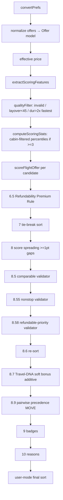

# OFFER_SELECTION_ENGINE.md

> Derived from repository source. Unconfirmed items marked **Not confirmed from repository.** For dimensional scoring/weights see [FLIGHT_RANKING_ENGINE.md](./FLIGHT_RANKING_ENGINE.md).

## Purpose

After offers are scored, FareMind applies a sequence of **selection** operations that decide the final displayed order, which offer earns the "AI Pick", the badges/tags, and the human-readable reasons. This document covers that post-scoring pipeline (the 8-dimension unified engine, [`src/lib/ai-scoring/engine.ts`](../src/lib/ai-scoring/engine.ts) `rankFlightOffers`).

## Where selection happens

Offers are scored per-offer, then re-ordered by a series of validators and precedence rules that can **move** offers without changing their scores. The distinction matters: scoring answers "how good is this offer"; selection answers "what should the user see first, and what do we call it."

## The pipeline (8-dim `rankFlightOffers`, engine.ts:376-745)

## Quality filter (`qualityFilterOffer`, L319-341)
Drops offers that are invalid, have a layover < 45 min, or a duration > 2× the fastest. This removes garbage before scoring stats are computed.

## Scoring stats
`computeScoringStats` uses 5th/95th-percentile clipping so a single outlier doesn't compress the range. When ≥3 offers exist, stats are computed within the cabin class.

## Selection validators (score-preserving or bounded)

| Step | Rule | Effect |
|---|---|---|
| 8.5 `FlightComparableValidator` | Compare truly comparable offers | Bounded adjustment |
| 8.55 `FlightComparableNonstopValidator` | Cheaper nonstop above pricier comparable nonstop (same cabin/refund/change/baggage, dur diff ≤25 dom/45 intl) unless meaningful advantage | Boost cheaper nonstop |
| 8.58 `FlightRefundablePriorityValidator` | Within nonstop+cabin+baggage group, boost higher flex tier to `lowerScore + 0.5` unless extreme price diff >35%, or meaningful schedule (≥20 pts)/duration advantage. **AI_PICK/BEST_VALUE only, NOT CHEAPEST** | Bounded boost |
| 8.7 Travel-DNA soft bonus | airline +≤5, cabin +≤3, stops +≤2 (additive only) | Small additive nudge |
| 8.9 `FlightPairwisePrecedenceService` | **MOVE** (splice) refundable immediately above its matched changeable — **does not change score**; skipped if refundable has CRITICAL warning | Position-only |

Flex tiers (`FlightRefundablePriorityValidator`): 0 refundable, 1 changeable, 2 neither.

## Badges / tags (`FlightBadgeEngine.ts`)

| Badge | Condition |
|---|---|
| **AI Pick** | max score & `aiPickEligible` & rank 0 |
| Cheapest | `rawTotalPrice ≤ min × 1.01` |
| Fastest | duration ≤ min + 5 |
| Fewest Stops / Nonstop | by stop count |
| Best Value | score ≥ 90 & ≤5% price & ≤10% duration |
| Recommended | score ≥ 90 |
| Baggage Included / Flexible Fare | by fare attributes |
| **Best Refundable Value** | `refundabilityUpgradeBonus ≥ 12` (one per set) |

Warning tags: Long Layover, Tight Connection, High Price, Poor Refund Terms, Long Duration, Near Fastest, Avoid <60, Provider Review <70.

## AI-Pick eligibility (`FlightScoringEngine.ts:381`)
`aiPickEligible = !aiPickBlocked && finalScore ≥ AI_PICK_MIN_SCORE (85)`. `aiPickBlocked` is set by warnings from `FlightWarningEngine.ts`:
- self-transfer, airport change, tight connection, provider revalidation risk (health < 70, CRITICAL), suspicious price (< 0.3× min, CRITICAL).

So an offer can be the top-scored yet be denied the AI Pick if it carries a blocking warning.

## Reasons (`FlightReasonGenerator.ts`)
Separates positive reasons (✓, capped 4) and negative warnings (✗, capped 4). `aiReasons` = up to 3-4 positives + all negatives, capped 5. These feed the UI and (optionally) the GPT explanation layer.

## Confidence (10-dim) 
`computeConfidence`: gap > 5 & no missing data → high; gap ≥ 2 or missing → medium; else low.

## Fare-family selection (separate concern)
[`ai-fare-scorer.ts`](../backend/src/services/ai-fare-scorer.ts) ranks fare *brands* of a single flight (used by `fare-options.ts`), with its own tie-break (comfort → cabinRank → seatScore → bags → price → AI score for the best_comfort badge). This is not offer-vs-offer selection.

## Business rules
- The cheapest offer is not automatically the AI Pick — quality, warnings, and refundability precedence can promote a slightly pricier, safer offer (within guard rails).
- Refundable fares are surfaced above comparable changeable fares (position MOVE) when the premium is small and there's no blocking warning.
- Blocking warnings (self-transfer, tight connection, suspicious price) veto the AI Pick regardless of score.

## Known issues / limitations
- Round-trip search uses the 10-dim engine, which has a **different** (and smaller) set of selection operations than this 8-dim pipeline — badges/precedence described here apply to one-way (and the RT fallback), not the RT primary. **Not confirmed** how the RT primary surfaces badges beyond route-level tagging.
- Multiple ordering passes (8.5–8.9) interact; reasoning about the final order requires tracing all of them.

## Future enhancements
- Bring RT selection to parity with the 8-dim badge/precedence logic, or document the RT badge path explicitly.

## Related docs
[FLIGHT_RANKING_ENGINE.md](./FLIGHT_RANKING_ENGINE.md) · [SYSTEM_OVERVIEW.md](./SYSTEM_OVERVIEW.md) · [FRONTEND_ARCHITECTURE.md](./FRONTEND_ARCHITECTURE.md)
