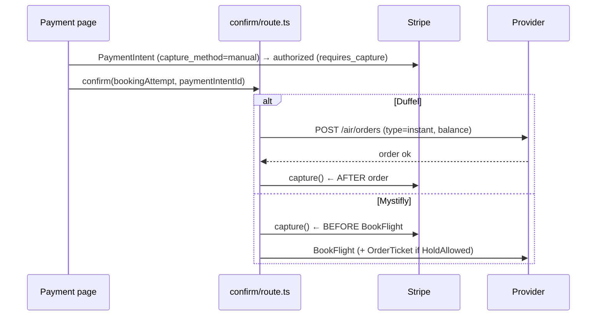

# PAYMENT_FLOW.md

> Derived from repository source. Unconfirmed items marked **Not confirmed from repository.**

## Purpose

Document how money moves: Stripe authorization/capture, when capture happens relative to each provider's booking, the provider-settlement (balance) model, and the cancellation/refund/reimbursement lifecycle.

## Overview

- **Customer payments:** Stripe (`stripe` SDK, [`src/lib/stripe.ts`](../src/lib/stripe.ts); backend `STRIPE_SECRET_KEY`).
- **Provider settlement:** Duffel is paid from a **Duffel account balance** (`payments:[{type:'balance'}]`); Mystifly debits an **agency balance** at BookFlight/OrderTicket. FareMind captures the customer's card via Stripe.
- **Auth-then-capture:** the PaymentIntent uses `capture_method: 'manual'`. The card is **authorized** at the payment step and **captured** only around the successful provider booking.
- Financial breakdown persists on `MasterBooking` (customer total, provider payable, FareMind revenue, third-party payables) and per-transaction on `BookingPayment`.

## What is sent to the provider

Only `providerPayableTotal` (provider fare + seat fees) is ever sent to a provider. Markup, service fee, insurance, and price protection are **never** sent to Duffel/Mystifly — they are FareMind/third-party revenue retained via Stripe ([`confirm/route.ts`](../src/app/api/checkout/bookings/confirm/route.ts) L492-496, L769-772).

## Capture timing — differs by provider

- **Duffel:** capture **after** `POST /air/orders` succeeds (`confirm/route.ts` L884-897). If capture fails after the order exists, it is logged CRITICAL and the booking still proceeds.
- **Mystifly:** capture **before** BookFlight (`confirm/route.ts` L1155-1178), because Mystifly debits the agency balance at BookFlight. If BookFlight fails after capture → Stripe refund (L1273-1285). **Exception:** ERBUK082 pending is **not** refunded (booking treated as valid & paid; reconciled later).

Pre-authorization checks (Phase 1b, L436-490): the PaymentIntent must be `requires_capture` (or `succeeded`), and the authorized amount must match the customer grand total (±$0.50).

## Payment-related API surface

| Route | Purpose |
|---|---|
| `POST /api/checkout/payment/create-intent` | Create the manual-capture PaymentIntent |
| `POST /api/checkout/payment/confirm` | Confirm intent client-side |
| `POST /api/checkout/bookings/confirm` | Master booking + capture orchestration |
| `POST /api/checkout/bookings/pre-revalidate` | Mystifly FSC refresh when payment page loads (commit `c883a17`) |
| `GET/POST /api/payment-methods`, `.../setup-intent`, `.../[id]/default` | Saved Stripe cards |
| `POST /api/service-payments`, `.../confirm` | Post-booking ancillary/CFAR/protection purchases |

## Persistence

- `BookingPayment` — one row per Stripe transaction (`stripePaymentIntentId`, `amount`, `status` = `MbPaymentTxStatus`, `paidAt`).
- `MasterBooking.paymentStatus` (`MbPaymentStatus`) — booking-level rollup.
- Legacy `Payment` + `LedgerEntry` — used by the price-tracking/rebooking engine.

## Cancellation / refund / reimbursement

Driven by the provider-agnostic [`cancellation-orchestrator.ts`](../backend/src/services/cancellation-orchestrator.ts). The refund identity is: **Provider Reimbursement = Customer Refund + FareMind Fee.**

### Method decision (`initiateCancellation`)
Method inferred from the quote id string: `isVoid = quoteId.includes('void')`; `isCancelAnyway = quoteId.includes('norefund')`; else `REFUND`. `isRefundable` from the primary PNR.

### Flow
1. Create `SupportTicket` (`CANCELLATION_SUPPORT` queue, `ticketType:'BOOKING_CANCELLATION'`).
2. `BookingEvent CANCELLATION_STARTED`.
3. **Provider cancel** — `provider.confirmCancellation(quoteId)`. On failure: ticket → `SUPPORT_REQUIRED` (HIGH), `BookingEvent CANCELLATION_FAILED`, throw `PROVIDER_CANCEL_FAILED`. **No booking-status change, no refund** on provider failure.
4. **Financials:**
   - `adminFee = isBookingRefundable ? getAdminServiceFee(booking) : 0`.
   - `effectiveRefundAmount = providerResult.refundAmount>0 ? providerResult.refundAmount : (isVoid ? originalAmount : 0)`.
   - `netRefundAmount = max(0, effectiveRefund − adminFee)`.
   - `newPaymentStatus = net<=0 ? NO_REFUND : isFullRefund ? REFUNDED : PARTIALLY_REFUNDED`.
   - `newTicketingStatus = isVoid ? VOIDED : isCancelAnyway ? CANCELLED : REFUND_PENDING`.
5. `MasterBooking.bookingStatus = CANCELLED` (+ PNR/journey/segment statuses).
6. `CancellationRecord` (`CANCEL_CONFIRMED`).
7. `BookingRefund` — `status: net>0 ? INITIATED : COMPLETED`; `processingDays: isVoid ? 5 : 10`; `providerReimbursementStatus: PENDING|NOT_STARTED`; `reconciliationStatus: RECONCILIATION_PENDING`; `nextProviderStatusCheckAt = now + 6h` when refund>0.
8. If `net>0` → fire-and-forget `processCustomerRefund`.

### Customer refund (`processCustomerRefund`)
`stripe.refunds.create({payment_intent, amount, reason:'requested_by_customer'}, {idempotencyKey})` against the latest `SUCCEEDED` `BookingPayment`.
- Success → `BookingRefund.status = CUSTOMER_REFUNDED`, ticket `REFUND_ISSUED`, `BookingEvent REFUND_PROCESSED`.
- Failure / no PaymentIntent → `CUSTOMER_REFUND_FAILED`, ticket `SUPPORT_REQUIRED` (HIGH), `BookingEvent REFUND_FAILED`.

### Provider reimbursement (`checkProviderReimbursement`, called by refund cron)
Polls `provider.getProviderRefundStatus`. Maps `SETTLED→REIMBURSED`, `PROCESSING→PROCESSING`, `REJECTED/FAILED→FAILED`, `PENDING/UNKNOWN→OVERDUE if >14 days else PENDING`. Progressive schedule (`calculateNextCheckAt`): ≤2d→6h, ≤7d→12h, ≤14d→24h, >14d→overdue.
- SETTLED → `onProviderReimbursed` → `reconcileRefund` (tolerance $0.01; ≤$1 rounding still MATCHED); MATCHED closes ticket + `CANCELLATION_JOURNEY_COMPLETED`; MISMATCH escalates to `REFUND_RECONCILIATION_QUEUE`.
- OVERDUE / FAILED → escalate existing ticket.

### Admin service fee (`getAdminServiceFee`)
Uses `booking.platformFee` if >0; else the active `PlatformFeeRule` (`SERVICE_FEE`), `fixedAmount × passengers` if `FIXED_PER_TRAVELER` else `fixedAmount`.

## Failure scenarios

| Scenario | Handling |
|---|---|
| Stripe auth not `requires_capture` | Reject before provider call |
| Duffel order fails | `cancelStripeAuth` (never charged); 502 `PROVIDER_ORDER_FAILED`; support ticket |
| Mystifly Book fails after capture | Stripe refund (L1273) |
| Mystifly ERBUK082 pending | **No refund**; reconcile |
| Capture fails after Duffel order | Logged CRITICAL; booking proceeds |
| Provider cancel fails | No refund; support ticket |
| Customer refund Stripe error | `CUSTOMER_REFUND_FAILED`; support ticket |

## Known issues / limitations

- The word "agency balance" is a Mystifly settlement concept described in comments; there is **no agency-balance ledger model** in the refund/reconciliation code — those files track customer refund / FareMind fee / provider reimbursement only. **Not confirmed from repository** whether an agency-balance ledger exists elsewhere.
- The refund cron only re-polls `PENDING`/`PROCESSING`; once a record is `OVERDUE` it falls out of the polling set. **Not confirmed** whether another job handles OVERDUE.
- Duffel capture-after-order means a capture failure leaves an issued order uncharged (logged CRITICAL, manual follow-up).

## Future enhancements
- Add an OVERDUE re-sweep to the refund cron.
- Consider capturing Duffel before order (or using a synchronous charge) to remove the uncharged-order edge case.

## Related docs
[BOOKING_LIFECYCLE.md](./BOOKING_LIFECYCLE.md) · [TICKETING_FLOW.md](./TICKETING_FLOW.md) · [MYSTIFLY_BOOKING_FLOW.md](./MYSTIFLY_BOOKING_FLOW.md) · [DUFFEL_INTEGRATION.md](./DUFFEL_INTEGRATION.md) · [BACKGROUND_JOBS.md](./BACKGROUND_JOBS.md)
