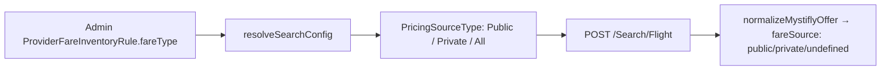

# PUBLIC_PRIVATE_WEBFARE.md

> Derived from repository source. Unconfirmed items marked **Not confirmed from repository.**

## Purpose

Clarify the three Mystifly fare categories — Public, Private, Webfare — how each is searched, how each is booked, how (and whether) each can be identified in FareMind, and the testing pitfalls.

## Definitions

| Fare type | Meaning | Identifiable in FareMind? |
|---|---|---|
| **Public** | Published fare available to all | Yes — `PricingSourceType`/`FareType` = Public |
| **Private** | Negotiated/agency fare | Yes — `PricingSourceType`/`FareType` = Private |
| **Webfare** | LCC/web-sourced fare requiring instant purchase | **No dedicated field.** Inferred only from `HoldAllowed = false` at revalidation |

## PricingSourceType (search request)

`MystiflyPricingSource = 'Public' | 'Private' | 'All'` ([`mystifly.ts` L48](../backend/src/services/mystifly.ts#L48)). In `searchFlights` the default is `'All'` (L608). The mapping `toPricingSourceType(fareType)` in [`mystifly.search-resolver.ts` L132](../backend/src/providers/mystifly/mystifly.search-resolver.ts#L132) converts `private→Private`, `public→Public`, else `All`. It is resolved from `ProviderFareInventoryRule.fareType` via `resolveSearchConfig` in the orchestrator.

So the **search side** can request Public, Private, or All — driven by admin `ProviderFareInventoryRule` rows.

## fareSource on UnifiedFlight (search response)

`normalizeMystiflyOffer` ([`normalizer.ts` L380-391](../backend/src/services/normalizer.ts#L380)) reads `FareType`/`pricingInfo.FareType`, lowercases it, and assigns `fareSource = 'private' | 'public' | undefined` on the flight (L421). This was added in commit `964a240`. The orchestrator also passes `FareType` through the denormalizer for both v2.2 and v1.

## Webfare — no field exists

There is **no code that maps any response field to a "webfare" flag.** The `[Mystifly][FareTypeDiag]` block ([`orchestrator.ts` L363-386](../backend/src/services/orchestrator.ts#L363)) is a **discovery probe** that logs which of these keys appear on raw offers:

```
IsWebFare, WebFare, WebFareType, FareType, ContentType, SupplierType, Supplier, IsLcc, FareSource
```

Its comment states the purpose is to "reveal whether values like 'WebFare' appear." As of the repository state, **no such field has been wired into a webfare classification.**

**Operationally, "webfare" is inferred purely from `HoldAllowed = false` at revalidation** (confirm/route.ts L1357-1360 comment). All v2/v2.2 flights are tagged `fareType='branded'` in the orchestrator.

## FareSourceCode (FSC)

The FSC is the opaque booking identifier, independent of Public/Private/Webfare. It is extracted from search itineraries and stored as `providerOfferId` on the flight and as `searchFareSourceCode`/`revalidatedFareSourceCode` on the booking. See [MYSTIFLY_BOOKING_FLOW.md](./MYSTIFLY_BOOKING_FLOW.md#provider-references).

## How each is searched



- Search with `PricingSourceType='All'` (default) returns both public and private.
- To certify a specific type, configure a `ProviderFareInventoryRule` with `fareType='public'` or `'private'`.

## How each is booked

Booking is identical mechanically (Revalidate → capture → BookFlight → OrderTicket). The **only** behavioral divergence is `HoldAllowed`:
- Public/Private that allow hold → `HoldAllowed=true` → OrderTicket issues the ticket.
- Webfares (and some fares) → `HoldAllowed=false` → instant purchase at BookFlight, no OrderTicket.

There is no separate booking code path per fare type — the flow branches on `HoldAllowed`, not on Public/Private/Webfare. See [HOLD_ALLOWED_ANALYSIS.md](./HOLD_ALLOWED_ANALYSIS.md).

## How to identify them

| Signal | Source | Reliable? |
|---|---|---|
| Public vs Private | `fareSource` on UnifiedFlight (from `FareType`) | Yes, when the provider populates `FareType` |
| Webfare | `HoldAllowed=false` at revalidation | Indirect — only known at revalidation, not at search |
| Raw probe | `[Mystifly][FareTypeDiag]` logs | Discovery only; not a classification |

To identify fare types from a live search, run a fresh search and read the Railway logs for `[Mystifly][FareTypeDiag]` (raw `FareType` value counts + which webfare/supplier keys are present). A prior JFK→DEL probe returned `{"Public":156}`.

## Testing strategy

1. **Public fare certification:** configure a `ProviderFareInventoryRule` with `fareType='public'`; run search; confirm `fareSource='public'` on results; complete a booking and verify OrderTicket/ticket numbers.
2. **Private fare certification:** same with `fareType='private'`.
3. **Webfare certification:** find a fare that revalidates with `HoldAllowed=false`; confirm the flow skips OrderTicket (`SKIPPED_WEBFARE`) and TripDetails yields ticket numbers.
4. Capture `[Mystifly][FareTypeDiag]` / `[Mystifly][SeatMapDiag]` from Railway for each.

## Common pitfalls

- Expecting a `webfare` field — there isn't one; use `HoldAllowed`.
- Assuming search `fareSource` predicts hold behavior — it does not; only revalidation's `HoldAllowed` does.
- Demo environment returns synthetic data → frequent ERBUK082 on revalidation (see [MYSTIFLY_BOOKING_FLOW.md](./MYSTIFLY_BOOKING_FLOW.md#erbuk082--pending-need--awaiting-carrier-response--booking-unconfirmed)).

## Known issues / limitations

- Webfare is not classifiable pre-revalidation. **Not confirmed from repository** whether any raw field reliably indicates webfare.
- `fareSource` is `undefined` when the provider omits `FareType`.

## Future enhancements

- If `[Mystifly][FareTypeDiag]` logs reveal a stable webfare indicator, wire it into `fareSource`/a `webfare` flag and surface it in ranking/UI.

## Related docs

[MYSTIFLY_BOOKING_FLOW.md](./MYSTIFLY_BOOKING_FLOW.md) · [HOLD_ALLOWED_ANALYSIS.md](./HOLD_ALLOWED_ANALYSIS.md)
