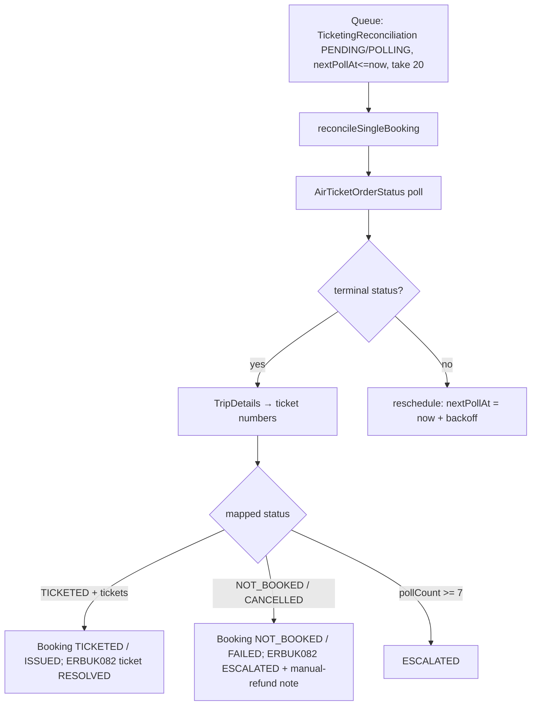

# TICKETING_FLOW.md

> Derived from repository source. Unconfirmed items marked **Not confirmed from repository.**

## Purpose

Document how tickets are issued and how ticketing status is resolved asynchronously — OrderTicket, `AirTicketOrderStatus` polling, TripDetails confirmation, the reconciliation worker, and the ERBUK082 pending path.

## Overview

Ticketing is only relevant to **Mystifly** (Duffel issues tickets synchronously at order creation). For Mystifly:
- **HoldAllowed=true** → `OrderTicket` issues the ticket (may return "Ticket-in Process" → pending).
- **HoldAllowed=false (webfare)** → no OrderTicket; ticket is issued at BookFlight.
- Any pending/uncertain state is queued into `TicketingReconciliation` and resolved by a 30-second cron.

## Enums

`MbTicketingStatus`: `NOT_STARTED | IN_PROGRESS | TICKETING_PENDING | ISSUED | PARTIALLY_ISSUED | FAILED | VOIDED`.
`TicketStatus` (per `BookingTicket`): `PENDING | ISSUED | VOIDED | REFUNDED | EXCHANGED`.
`TicketReconStatus`: `PENDING | POLLING | TICKETED | NOT_BOOKED | MANUAL_REVIEW | ESCALATED | RESOLVED | FAILED`.

## Ticket issuance

- `orderTicket(uniqueId, fareSourceCode, clientReferenceNo)` → `POST /api/v1/OrderTicket`, `retries:0` ([`mystifly.ts` L716-736](../backend/src/services/mystifly.ts#L716)). Doc: "Only call AFTER Stripe payment succeeds."
- Route `POST /book` explicitly does **not** issue tickets ([`mystifly-booking.ts` L293](../backend/src/routes/mystifly-booking.ts#L293)); `orderTicket` is called from the ticket-issuing route at L441.
- Status field precedence: `Data.TktStatus || Data.Status || Status` (route L553; worker L126-128). Ticket numbers: `Data.TicketNumbers || Data.ETicketNumbers`.

## Reconciliation worker

[`backend/src/workers/ticketing-reconciliation.ts`](../backend/src/workers/ticketing-reconciliation.ts), driven by [`ticketing-reconciliation-cron.ts`](../backend/src/workers/ticketing-reconciliation-cron.ts) (30s interval, first run 20s after boot). Entry: `runTicketingReconciliation()`.

### Queue selection (`runTicketingReconciliation` L51-103)
- `TicketingReconciliation` where `status IN ['PENDING','POLLING']` AND (`nextPollAt = null` OR `<= now`), ordered `createdAt asc`, take 20.
- On a thrown error per record: set `errorMessage`, `pollCount+1`, reschedule `nextPollAt = now + getNextPollIntervalMs(pollCount+1)`.

### Per-record (`reconcileSingleBooking` L107-340)
1. Mark `status:'POLLING'`, set `lastPollAt`.
2. **AirTicketOrderStatus** poll (failures caught, polling continues).
3. **TripDetails** confirmation — only if the status is terminal; harvests ticket numbers from `CustomerInfos[].ETicketNumbers | TicketDocumentInfo` (deduped; "more reliable").
4. Map via `mapProviderBookingStatus`. Four outcomes:

| Outcome | Condition | Effects |
|---|---|---|
| **RESOLVED_TICKETED** | mapped `TICKETED` + tickets>0 | recon `TICKETED`+`resolvedAt`; `MasterBooking` `bookingStatus:TICKETED`, `ticketingStatus:ISSUED`; `BookingEvent TICKETING_RESOLVED`; `updateErbukTicket(RESOLVED)` |
| **RESOLVED_NOT_BOOKED** | mapped `NOT_BOOKED`/`CANCELLED` | recon `NOT_BOOKED`; `MasterBooking` `NOT_BOOKED`/`FAILED`; `BookingEvent TICKETING_FAILED` ("manual review may be required for refund"); `updateErbukTicket(ESCALATED)` |
| **ESCALATED** | `pollCount+1 >= MAX_AUTO_POLLS (7)` | recon `ESCALATED`+`escalatedAt`; `BookingEvent TICKETING_ESCALATED`; booking unchanged; `updateErbukTicket(ESCALATED)` |
| **STILL_PENDING** | otherwise | recon back to `PENDING` with `nextPollAt = now + getNextPollIntervalMs(pollCount+1)` |

Backoff (`getNextPollIntervalMs`): `[0, 15s, 30s, 60s, 2m, 5m, 10m]`, then `-1`. `MAX_AUTO_POLLS = 7`.

### Queue entry
`queueForReconciliation({bookingId, providerUniqueId, fareSourceCode})` (L391-420) dedups on an existing PENDING/POLLING row, then inserts `status:'PENDING'`, `nextPollAt: now` (poll immediately). Called from the confirm route (L2132). **Not confirmed** whether the `/book` proxy also enqueues.

### ERBUK082 ticket updates
`updateErbukTicket(bookingId, {status, note})` (L352-383) finds the newest open `SupportTicket` with `correlationId=bookingId`, `category:'ERBUK082'`; updates status (`closedAt` when RESOLVED, `escalatedAt` when ESCALATED) and appends a customer-visible `SupportTicketMessage`.

## Admin operations
- `getPendingQueue()` — lists recon rows `PENDING/POLLING/ESCALATED/MANUAL_REVIEW`.
- `manuallyResolve({reconciliationId, resolution, ticketNumbers, adminEmail, notes})` — `TICKETED`/`NOT_BOOKED`/`RESOLVED`; updates booking + ERBUK082 ticket; logs `BookingEvent TICKETING_MANUALLY_RESOLVED` (`actorType:'admin'`).

## Known issues / limitations
- `shouldPollStatus` is imported but not referenced in the worker body; `mappedTicketingStatus` is computed but never written — **dead code, not confirmed intentional.**
- `MANUAL_REVIEW` is queried by `getPendingQueue` but never written by these files — **origin not confirmed.**
- No timer issues `OrderTicket` for held bookings before hold expiry (the worker polls status only). **Not confirmed** whether Mystifly auto-cancels.
- Queue-entry call site from the `/book` proxy is **not confirmed.**

## Future enhancements
- Remove/clarify dead code (`shouldPollStatus`, `mappedTicketingStatus`).
- Add a held-booking auto-ticketing job (see [HOLD_ALLOWED_ANALYSIS.md](./HOLD_ALLOWED_ANALYSIS.md)).

## Related docs
[MYSTIFLY_BOOKING_FLOW.md](./MYSTIFLY_BOOKING_FLOW.md) · [HOLD_ALLOWED_ANALYSIS.md](./HOLD_ALLOWED_ANALYSIS.md) · [BACKGROUND_JOBS.md](./BACKGROUND_JOBS.md) · [PAYMENT_FLOW.md](./PAYMENT_FLOW.md)
