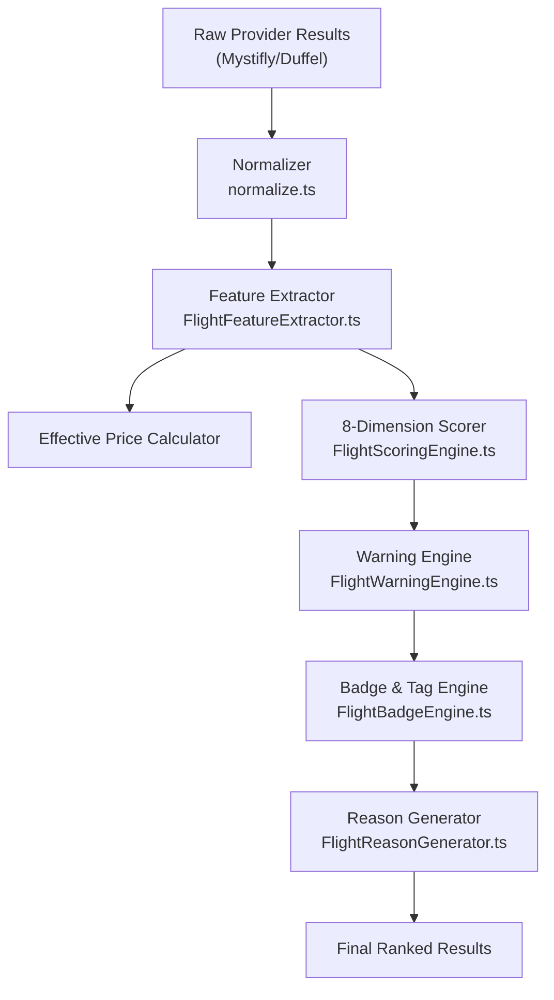
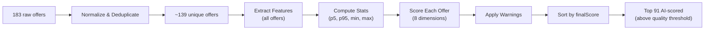

# FareMind Flight Ranking & Scoring Algorithm

## Architecture

## 8 Scoring Dimensions

Each flight is scored on 8 dimensions (0–100), then combined using weighted sum:

| # | Dimension | One-Way Weight | Round-Trip Weight | Intl OW Weight | Intl RT Weight |
|---|-----------|---------------|------------------|---------------|---------------|
| 1 | **Effective Price** | 36% | 34% | 35% | 35% |
| 2 | **Duration** | 23% | 21% | 21% | 19% |
| 3 | **Stops** | 15% | 14% | 10% | 10% |
| 4 | **Baggage Value** | 10% | 11% | 12% | 13% |
| 5 | **Layover Quality** | 7% | 8% | 10% | 10% |
| 6 | **Schedule** | 4% | 5% | 4% | 5% |
| 7 | **Fare Flexibility** | 3% | 4% | 5% | 5% |
| 8 | **Provider Reliability** | 2% | 3% | 3% | 3% |

> [!NOTE]
> International routes reduce the Stops weight (1 stop is normal for intl) and boost Baggage/Layover/Flexibility (bigger impact on intl trips).

---

## Dimension Scoring Details

### 1. Effective Price (35-36%)
- Uses **p5–p95 clipped normalization** against all search results
- Cheapest flight = 100, most expensive = 0
- **Guardrails**: Within 3% of cheapest → floor at 93; within 5% → floor at 88
- **Effective price** = base fare + estimated bag costs (if bags not included: $35 domestic, $75 intl per piece)

### 2. Duration (19-23%)
- **p5–p95 clipped normalization** against all results
- Shortest = 100, longest = 0

### 3. Stops (10-15%)
| Stops | Score |
|-------|-------|
| Nonstop | 100 |
| 1 stop | 85 |
| 2 stops | 72 |
| 3 stops | 58 |
| 4 stops | 45 |
| 5+ stops | 30 |

### 4. Baggage Value (10-13%)
| Included | Score |
|----------|-------|
| 2+ checked + carry-on | 100 |
| 1 checked + carry-on | 90 |
| Carry-on only | 70 |
| Checked only, no carry-on stated | 60 |
| Nothing (intl) | 42 |
| Nothing (domestic) | 50 |
- **User adjustments**: carry-on-only pref boosts no-checked-bag score by 50%; family/elderly penalizes -10 if no checked bags

### 5. Layover Quality (7-10%)
Starts at 100 (nonstop), then deductions per layover:

| Condition | Deduction |
|-----------|-----------|
| < 75min intl / < 45min domestic | -25 |
| < 90min intl / < 60min domestic | -10 |
| > 5h | -15 |
| > 8h | -30 |
| Overnight (10h+) | -35 |
| Airport change | -30 |
| Self-transfer | -30 |

### 6. Schedule Convenience (4-5%)
Starts at 100, deductions for:
- **Red-eye** (depart 9pm+, arrive 4-9am): -10 (-15 if user pref)
- **Pre-dawn departure** (midnight–6am): -8 (-12 for family/elderly)
- **Late arrival** (11pm+): -8
- **Intl early arrival** (midnight–5am): -6

### 7. Fare Flexibility (3-5%)
| Condition | Score |
|-----------|-------|
| Refundable + Changeable | 100 |
| Refundable only | 80 |
| Changeable only | 75 |
| Neither | 40 |
- **Firm dates** preference: +20 boost if score < 60

### 8. Provider Reliability (2-3%)
- Based on provider health metrics and known reliability scores

---

## Scoring Modes

User can select a scoring mode that applies multipliers on top of base weights:

| Mode | Price | Duration | Stops | Baggage | Layover | Schedule | Flexibility |
|------|-------|----------|-------|---------|---------|----------|------------|
| **AI Pick** | 1.0× | 1.0× | 1.0× | 1.0× | 1.0× | 1.0× | 1.0× |
| **Best Value** | 1.2× | 1.1× | 1.0× | 1.0× | 1.0× | 1.0× | 1.0× |
| **Cheapest** | 1.6× | 0.7× | 0.7× | 0.6× | 1.0× | 1.0× | 1.0× |
| **Fastest** | 0.6× | 1.8× | 1.2× | 1.0× | 1.1× | 1.0× | 1.0× |
| **Fewest Stops** | 0.7× | 1.0× | 2.3× | 1.0× | 0.6× | 1.0× | 1.0× |
| **Comfort** | 0.6× | 1.0× | 1.4× | 1.4× | 1.5× | 1.5× | 1.0× |
| **Family** | 0.7× | 1.0× | 1.3× | 1.8× | 1.6× | 1.5× | 1.0× |
| **Elderly** | 0.7× | 1.2× | 1.8× | 1.3× | 1.7× | 1.6× | 1.0× |
| **Flexible Fare** | 0.7× | 0.8× | 1.0× | 1.0× | 1.0× | 1.0× | 3.0× |

> [!TIP]
> After multiplying, weights are re-normalized to sum to 1.0.

---

## Warning Penalties

After base scoring, warnings are generated and deducted from the base score:

`finalScore = baseScore - warningPenalty - compoundWarningPenalty`

| Warning | Severity | Penalty |
|---------|----------|---------|
| **Self-transfer** | CRITICAL | -16 |
| **Airport change** | CRITICAL | -15 |
| **Suspicious price** | CRITICAL | -16 |
| **Provider revalidation risk** | CRITICAL | -15 |
| **Tight connection** | CRITICAL | -14 |
| **Extreme duration** | MAJOR | -9 |
| **Overnight layover** | MAJOR | -7 |
| **3+ connections** | MAJOR | -7 |
| **Significantly longer** | MAJOR | -6 |
| **Non-refundable + non-changeable** | MAJOR | -6 |
| **No checked bag (intl)** | MEDIUM | -5 |
| **Long layover** | MEDIUM | -4 |
| **Low data confidence** | MEDIUM | -4 |
| **Paid baggage only** | MEDIUM | -4 |
| **Non-refundable** | MEDIUM | -3 |
| **Non-changeable** | MEDIUM | -3 |
| **Slightly higher price** | MINOR | -1.5 |
| **Early morning departure** | MINOR | -1.5 |

---

## Soft Constraints

Applied after warning penalties:

- **Over budget**: Up to -25 penalty (proportional to % over budget)
- **Over max duration**: Up to -20 penalty
- **Nonstop preference but has stops**: ×0.6 multiplier
- **1-stop preference but 2+ stops**: ×0.75 multiplier

---

## AI Pick Eligibility

A flight qualifies for the "AI Pick" badge when:
- `finalScore >= 85`
- No AI-pick-blocking warnings (CRITICAL severity)

---

## Pipeline Flow

### Key Files

| File | Purpose |
|------|---------|
| [FlightScoringEngine.ts](file:///c:/FareMind/src/lib/ai-scoring/FlightScoringEngine.ts) | Core 8-dimension scorer |
| [FlightScoringConfig.ts](file:///c:/FareMind/src/lib/ai-scoring/FlightScoringConfig.ts) | Weights, modes, penalties |
| [FlightFeatureExtractor.ts](file:///c:/FareMind/src/lib/ai-scoring/FlightFeatureExtractor.ts) | Extract features from normalized offers |
| [FlightEffectivePriceService.ts](file:///c:/FareMind/src/lib/ai-scoring/FlightEffectivePriceService.ts) | Effective price with estimated bag costs |
| [FlightWarningEngine.ts](file:///c:/FareMind/src/lib/ai-scoring/FlightWarningEngine.ts) | Warning generation & penalty calculation |
| [FlightBadgeEngine.ts](file:///c:/FareMind/src/lib/ai-scoring/FlightBadgeEngine.ts) | AI Pick, Best Value, Cheapest badges |
| [FlightReasonGenerator.ts](file:///c:/FareMind/src/lib/ai-scoring/FlightReasonGenerator.ts) | Human-readable "why we recommend" reasons |
| [engine.ts](file:///c:/FareMind/src/lib/ai-scoring/engine.ts) | Full ranking pipeline orchestrator |
